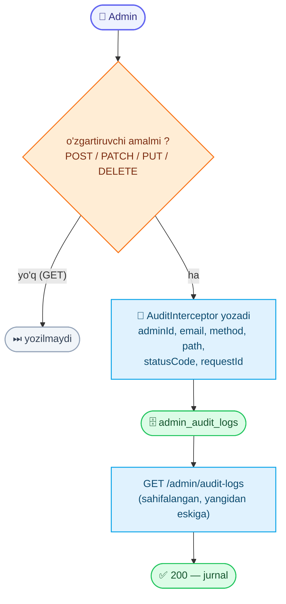

# Admin audit jurnali (Audit log)

Adminlarning **o'zgartiruvchi** amallari (kim, nimani, qachon) avtomatik yoziladigan **faqat-o'qish** jurnal. Har bir admin-autentifikatsiyali `POST` / `PATCH` / `PUT` / `DELETE` so'rovi global `AuditInterceptor` tomonidan yoziladi — kod tomonida hech narsa qo'shish shart emas. O'qish (`GET`) so'rovlari yozilmaydi.

Base URL: `https://api.fixleo.com/api/v1`

> **Faqat admin.** `Authorization: Bearer <admin accessToken>` talab qilinadi (qarang `AdminLogin.md`); `admin` va `superadmin` rollari kira oladi.

> **Til:** `message` `Accept-Language` (uz / ru / en) bo'yicha tarjimalanadi. Umumiy format/qoidalar: `Backend Config for client.md`.

---

## 🔄 Jarayon sxemasi (workflow)



---

## Yozuv (`AuditLogEntry`) maydonlari

| Maydon       | Turi           | Izoh                                                       |
| ------------ | -------------- | ---------------------------------------------------------- |
| `id`         | number         | Yozuv id                                                   |
| `adminId`    | number \| null | Amalni bajargan adminning DB id'si                         |
| `adminEmail` | string \| null | Adminning emaili (o'qishga qulay)                          |
| `method`     | string         | HTTP metodi: `POST` / `PATCH` / `PUT` / `DELETE`           |
| `path`       | string         | So'rov yo'li, masalan `/api/v1/admin/verifications/5/approve` |
| `statusCode` | number \| null | Javob status kodi (masalan `200`, `201`)                   |
| `requestId`  | string \| null | Korrelyatsiya id (javobdagi `X-Request-Id` bilan bir xil)  |
| `createdAt`  | string (ISO)   | Amal vaqti                                                 |

---

## 1. Audit jurnalini ko'rish

`GET /admin/audit-logs`

Sahifalangan, **eng yangisi birinchi** (`createdAt desc`) ro'yxat.

**Query parametrlari:**

| Param   | Turi   | Default | Izoh                                |
| ------- | ------ | ------- | ----------------------------------- |
| `page`  | number | `1`     | Sahifa raqami (1 dan boshlanadi)    |
| `limit` | number | `20`    | Sahifadagi yozuvlar (maksimum `100`) |

**Misol:** `GET /admin/audit-logs?page=1&limit=20`

**Response `200`:**

```json
{
  "success": true,
  "message": "Audit log",
  "data": {
    "items": [
      {
        "id": 42,
        "adminId": 1,
        "adminEmail": "admin@fixleo.local",
        "method": "POST",
        "path": "/api/v1/admin/verifications/5/approve",
        "statusCode": 200,
        "requestId": "6a4a3cbd-f024-4a51-9f99-77446582c7e3",
        "createdAt": "2026-06-16T04:00:00.000Z"
      }
    ],
    "meta": { "total": 128, "page": 1, "limit": 20, "totalPages": 7 }
  }
}
```

**Xatolar:**

| Kod | Sabab                        | Izoh                      |
| --- | ---------------------------- | ------------------------- |
| 401 | Admin token yo'q / noto'g'ri | `Access token is missing` |
| 403 | Admin emas / ruxsat yetmaydi | `Insufficient permissions` |

---

## Nima yoziladi?

- ✅ **Yoziladi:** har qanday admin `POST` / `PATCH` / `PUT` / `DELETE` — masalan verifikatsiyani tasdiqlash/rad etish, master/client block/unblock, client yaratish/tahrirlash/o'chirish, reset-otp, kategoriya va radius CRUD.
- ❌ **Yozilmaydi:** `GET` (o'qish) so'rovlari va admin bo'lmagan (client/master/anonim) so'rovlar.

> Har bir yozuvdagi `requestId` o'sha so'rovning loglari va xato javobidagi `requestId` bilan bir xil — bitta amalni uchma-uch kuzatish mumkin.

---

## Endpointlar xulosasi

| Method | Route                 | Auth  | Vazifa                  | Message     |
| ------ | --------------------- | ----- | ----------------------- | ----------- |
| `GET`  | `/admin/audit-logs`   | admin | Audit jurnali (sahifalangan) | `Audit log` |

Swagger: `https://api.fixleo.com/api/docs` ("Admin: Audit log" bo'limi).
