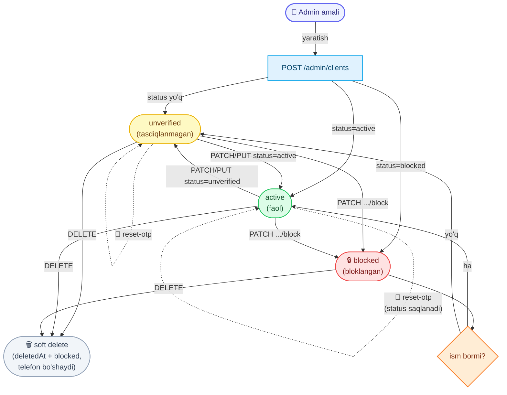

# Admin: Clientlarni boshqarish

Admin panel uchun **client (end-user) accountlarini boshqarish** hujjati — ro'yxat, ko'rish, yaratish, tahrirlash, o'chirish, bloklash va sessiyani reset qilish.

> **Dizayn eslatmasi:** Clientlar **parol ishlatmaydi** — ular telefon + SMS OTP orqali kiradi (qarang `LoginOrRegisterClient.md`). Shu sababli bu yerda "parol reset" yo'q. Uning o'rniga kirishni nazorat qilish **block / unblock** va **reset-otp** (kutilayotgan OTP'ni tozalash) orqali amalga oshiriladi.

Base URL: `https://api.fixleo.com/api/v1`

> **Til:** barcha `message` (va validatsiya `errors[].message`) `Accept-Language` (uz / ru / en) bo'yicha tarjimalanadi — misollarda inglizcha keltirilgan. Umumiy qoidalar: `Backend Config for client.md`.

Barcha route'lar **admin token** talab qiladi (qarang `AdminLogin.md`):

```
Authorization: Bearer <admin accessToken>
```

`admin` va `superadmin` rollarining ikkalasi ham kira oladi. Client tokeni bu endpointlarda **ishlamaydi** (`401`).

Barcha javoblar standart konvertda:

```json
{ "success": true, "message": "...", "data": {} }
```

Xatolar:

```json
{ "success": false, "message": "...", "statusCode": 404, "path": "...", "timestamp": "...", "requestId": "..." }
```

> **Korrelyatsiya ID:** har bir javobda `X-Request-Id` header bo'ladi, xato konvertida esa shu qiymat `requestId` maydonida qaytadi (log va support uchun). Inbound `X-Request-Id` header yuborilsa, o'sha qayta ishlatiladi.

> **`:id` haqida:** path parametri sifatida **raqamli** DB id ishlatiladi (masalan `3`), `#U-...` formati emas. Javoblarda esa public id `#U-00000000003` ko'rinishida qaytadi.

## 🔄 Jarayon sxemasi (workflow)

Quyida client statusining (`unverified` / `active` / `blocked`) admin amallari ostida o'zgarishi ko'rsatilgan. `reset-otp` statusni o'zgartirmaydi (faqat Redis'dagi kutilayotgan OTP'ni tozalaydi), `delete` esa **soft delete** — account ro'yxatdan yo'qoladi (`deletedAt`), `blocked` ga o'tadi va telefon raqami **bo'shatiladi** (xuddi shu raqam qaytadan ro'yxatdan o'ta oladi).



---

## 1. Clientlar ro'yxati

`GET /admin/clients`

Sahifalangan (paginated) ro'yxat. Ixtiyoriy qidiruv va status filtri bilan.

**Query parametrlari:**

| Param    | Turi   | Default | Izoh                                                       |
| -------- | ------ | ------- | ---------------------------------------------------------- |
| `page`   | number | `1`     | Sahifa raqami (1 dan boshlanadi)                           |
| `limit`  | number | `20`    | Sahifadagi elementlar soni (maksimum `100`)                |
| `search` | string | —       | Telefon yoki ism bo'yicha qidiruv (katta-kichik harf farqsiz) |
| `status` | enum   | —       | `unverified` \| `active` \| `blocked` bo'yicha filtr       |

**Misol:** `GET /admin/clients?page=1&limit=10&search=99890&status=active`

**Response `200`:**

```json
{
  "success": true,
  "message": "Clients list",
  "data": {
    "items": [
      {
        "id": "#U-00000000003",
        "phone": "+998901112233",
        "name": "Hojiakbar Murodillayev",
        "status": "active",
        "blockReason": null,
        "createdAt": "2026-06-13T23:00:05.450Z",
        "updatedAt": "2026-06-13T23:00:05.450Z"
      }
    ],
    "meta": { "total": 42, "page": 1, "limit": 10, "totalPages": 5 }
  }
}
```

Natijalar `createdAt` bo'yicha kamayish tartibida (eng yangisi birinchi) qaytadi.

---

## 2. Bitta clientni ko'rish

`GET /admin/clients/:id`

**Response `200`:**

```json
{
  "success": true,
  "message": "Client details",
  "data": {
    "id": "#U-00000000003",
    "phone": "+998901112233",
    "name": "Hojiakbar Murodillayev",
    "status": "active",
    "blockReason": null,
    "createdAt": "2026-06-13T23:00:05.450Z",
    "updatedAt": "2026-06-13T23:00:05.450Z"
  }
}
```

**Xatolar:**

| Kod | Sabab               | Message              |
| --- | ------------------- | -------------------- |
| 404 | Client topilmadi    | `Client #3 not found` |

---

## 3. Yangi client yaratish

`POST /admin/clients`

Faqat `phone` majburiy va **unique** bo'lishi shart. Qolgan maydonlar ixtiyoriy.

**Request:**

```json
{
  "phone": "+998901112233",
  "name": "Hojiakbar Murodillayev",
  "status": "active",
  "blockReason": null
}
```

| Maydon        | Majburiy | Qoidalar                                                        |
| ------------- | -------- | --------------------------------------------------------------- |
| `phone`       | ✅       | Xalqaro format, `+` bilan: `+998901234567`. Unique bo'lishi shart |
| `name`        | ❌       | 3–100 belgi. Berilmasa `null`                                   |
| `status`      | ❌       | `unverified` \| `active` \| `blocked`. Default `unverified`     |
| `blockReason` | ❌       | Faqat `status: "blocked"` bo'lganda saqlanadi, aks holda `null` |

**Response `201`:**

```json
{
  "success": true,
  "message": "Client created",
  "data": {
    "id": "#U-00000000003",
    "phone": "+998901112233",
    "name": "Hojiakbar Murodillayev",
    "status": "active",
    "blockReason": null,
    "createdAt": "2026-06-13T23:00:05.450Z",
    "updatedAt": "2026-06-13T23:00:05.450Z"
  }
}
```

**Xatolar:**

| Kod | Sabab                       | Message                                                    |
| --- | --------------------------- | ---------------------------------------------------------- |
| 400 | Telefon formati noto'g'ri   | `Phone must be in international format, e.g. +998901234567` |
| 409 | Bu telefon allaqachon mavjud | `A client with phone +998901112233 already exists`         |

---

## 4. Clientni tahrirlash — qisman (PATCH)

`PATCH /admin/clients/:id`

Faqat **yuborilgan maydonlar** o'zgaradi. Hammasi ixtiyoriy.

**Request (masalan, faqat ism):**

```json
{ "name": "Yangi Ism" }
```

| Maydon        | Qoidalar                                                                |
| ------------- | ----------------------------------------------------------------------- |
| `phone`       | Xalqaro format, unique bo'lishi shart                                   |
| `name`        | 3–100 belgi                                                             |
| `status`      | `unverified` \| `active` \| `blocked`                                   |
| `blockReason` | `status: "blocked"` ga o'rnatilganda qo'llanadi                        |

> **Izchillik qoidasi:** `status` `blocked`dan boshqa qiymatga o'zgartirilsa, `blockReason` avtomatik `null` qilinadi.

**Response `200`:** yangilangan `client` obyekti (`"message": "Client updated"`).

**Xatolar:** `400` (validatsiya), `404` (topilmadi), `409` (telefon band).

---

## 5. Clientni almashtirish — to'liq (PUT)

`PUT /admin/clients/:id`

Profilni **to'liq** qayta yozadi. `phone`, `name`, `status` majburiy.

**Request:**

```json
{
  "phone": "+998901112233",
  "name": "Hojiakbar Murodillayev",
  "status": "active",
  "blockReason": null
}
```

| Maydon        | Majburiy | Qoidalar                                          |
| ------------- | -------- | ------------------------------------------------- |
| `phone`       | ✅       | Xalqaro format, unique                            |
| `name`        | ✅       | 3–100 belgi                                       |
| `status`      | ✅       | `unverified` \| `active` \| `blocked`             |
| `blockReason` | ❌       | Faqat `status: "blocked"` bo'lganda saqlanadi     |

**Response `200`:** almashtirilgan `client` obyekti (`"message": "Client replaced"`).

**Xatolar:** `400` (validatsiya), `404` (topilmadi), `409` (telefon band).

---

## 6. Clientni o'chirish

`DELETE /admin/clients/:id`

Accountni **soft delete** qiladi — **butunlay o'chirilmaydi**. Qator bazada saqlanib qoladi (audit uchun), faqat quyidagilar bajariladi:

- `deletedAt` o'rnatiladi → client barcha ro'yxat va ko'rish endpointlaridan **yo'qoladi** (`GET /admin/clients`, `GET /admin/clients/:id` endi `404` qaytaradi).
- `status` → `blocked` ga o'tkaziladi.
- Telefon raqami **bo'shatiladi** (bazada `deleted:<id>:<asl-telefon>` ko'rinishida saqlanadi), shu sababli **xuddi shu raqam qaytadan ro'yxatdan o'ta oladi** (yangi `unverified` account sifatida).

**Response `200`:**

```json
{ "success": true, "message": "Client deleted", "data": null }
```

**Xatolar:**

| Kod | Sabab            | Message               |
| --- | ---------------- | --------------------- |
| 404 | Client topilmadi (yoki allaqachon o'chirilgan) | `Client #3 not found` |

> Client o'zini ham o'chira oladi: `DELETE /clients/me` (client tokeni bilan) — bu ham xuddi shunday soft delete (qarang `LoginOrRegisterClient.md`).

---

## 7. Clientni bloklash

`PATCH /admin/clients/:id/block`

`status`ni `blocked`ga o'rnatadi. Sabab ixtiyoriy — bloklangan client kirishga urinsa shu sabab `403` xabarida ko'rinadi.

**Request:**

```json
{ "reason": "Spam / abuse" }
```

**Response `200`:**

```json
{
  "success": true,
  "message": "Client blocked",
  "data": {
    "id": "#U-00000000003",
    "phone": "+998901112233",
    "name": "Hojiakbar Murodillayev",
    "status": "blocked",
    "blockReason": "Spam / abuse",
    "createdAt": "2026-06-13T23:00:05.450Z",
    "updatedAt": "2026-06-13T23:00:24.996Z"
  }
}
```

> **Block darhol va global kuchga kiradi.** Har bir client so'rovida (himoyalangan endpointlar `ClientJwtAuthGuard` orqali, hamda public OTP flow) account bazadan qayta tekshiriladi. Bloklangan client **hech qanday client API'dan** foydalana olmaydi — amaldagi (hali eskirmagan) access token bilan ham — va javob `403 Account is blocked: <sabab>` qaytaradi. Bu qoida kelajakda qo'shiladigan client route'larga ham avtomatik tatbiq etiladi (guard'dan foydalansa kifoya).

---

## 8. Clientni blokdan chiqarish

`PATCH /admin/clients/:id/unblock`

Body kerak emas. `blockReason` tozalanadi va status tiklanadi:

- ism mavjud bo'lsa → `active`
- ism `null` bo'lsa (registratsiya tugamagan) → `unverified`

**Response `200`:** yangilangan `client` obyekti (`"message": "Client unblocked"`, `blockReason: null`).

---

## 9. Sessiyani reset qilish (OTP tozalash)

`PATCH /admin/clients/:id/reset-otp`

Body kerak emas. Clientning **kutilayotgan OTP kodini** tozalaydi, shunda keyingi kirishda yangi kod so'rashga majbur bo'ladi.

> **OTP Redis'da saqlanadi:** kod endi bazada emas, **Redis**'da turadi — kalit `otp:client:<phone>`, TTL `5 daqiqa` (bazadagi `otpCode` / `otpExpiresAt` ustunlari olib tashlangan). `reset-otp` aynan shu Redis kalitini o'chiradi. Bu master OTP oqimi bilan bir xil.

**Response `200`:** `client` obyekti (`"message": "OTP reset"`).

> JWT access tokenlari stateless (15 daqiqa) — ular bekor qilinmaydi. Faol sessiyani darhol to'xtatish kerak bo'lsa, **block**dan foydalaning.

---

## Umumiy xatolar

| Kod | Sabab                                              | Message                          |
| --- | -------------------------------------------------- | -------------------------------- |
| 400 | Request body / query validatsiyadan o'tmadi        | validatsiya xabari               |
| 401 | Token yo'q                                          | `Access token is missing`        |
| 401 | Token noto'g'ri / eskirgan                          | `Invalid or expired access token` |
| 401 | Client tokeni admin route'da ishlatildi            | `Invalid token type`             |
| 403 | Yetarli huquq yo'q                                 | `Insufficient permissions`       |
| 404 | Client topilmadi (yoki soft-delete qilingan)       | `Client #<id> not found`         |
| 409 | Telefon allaqachon band                            | `A client with phone ... already exists` |

> **Rate-limit (429):** bu admin endpointlarining o'zida throttling yo'q. Lekin admin **login** (token olish) himoyalangan: noto'g'ri parol ko'p marta kiritilsa email `15 daqiqaga` qulflanadi (`429`, `errors.account_locked`), hamda har bir IP uchun `30/min` byudjet bor (`429`, `errors.too_many_requests`) — batafsil `AdminLogin.md`.

> **Audit:** har bir admin tomonidan bajarilgan **mutatsion** so'rov (POST/PATCH/PUT/DELETE — yaratish, tahrirlash, block/unblock, reset-otp, delete) avtomatik yozib boriladi. Yozuvlarni `GET /api/v1/admin/audit-logs` orqali ko'rish mumkin (admin-only, sahifalangan, eng yangisi birinchi).

---

## Client statuslari

| Status       | Ma'nosi                                                                    |
| ------------ | -------------------------------------------------------------------------- |
| `unverified` | Telefon hali tasdiqlanmagan                                                |
| `active`     | To'liq ro'yxatdan o'tgan, faol                                             |
| `blocked`    | Bloklangan — `blockReason`da sababi. Client auth amallari `403` qaytaradi  |

## ID formati

- **So'rovda** (`:id`): raqamli DB id — `3`, `42`, ...
- **Javobda** (`id`): public format — `#U-00000000003` (11 xonagacha nol bilan to'ldiriladi).

## Endpointlar xulosasi

| Method  | Route                          | Vazifa                  | Message            |
| ------- | ------------------------------ | ----------------------- | ------------------ |
| `GET`   | `/admin/clients`               | Ro'yxat (filter + page) | `Clients list`     |
| `GET`   | `/admin/clients/:id`           | Bitta client            | `Client details`   |
| `POST`  | `/admin/clients`               | Yaratish (`201`)        | `Client created`   |
| `PATCH` | `/admin/clients/:id`           | Qisman tahrirlash       | `Client updated`   |
| `PUT`   | `/admin/clients/:id`           | To'liq almashtirish     | `Client replaced`  |
| `DELETE`| `/admin/clients/:id`           | O'chirish (soft delete) | `Client deleted`   |
| `PATCH` | `/admin/clients/:id/block`     | Bloklash                | `Client blocked`   |
| `PATCH` | `/admin/clients/:id/unblock`   | Blokdan chiqarish       | `Client unblocked` |
| `PATCH` | `/admin/clients/:id/reset-otp` | Sessiya reset           | `OTP reset`        |

Swagger: `https://api.fixleo.com/api/docs` ("Admin: Clients" bo'limi).
