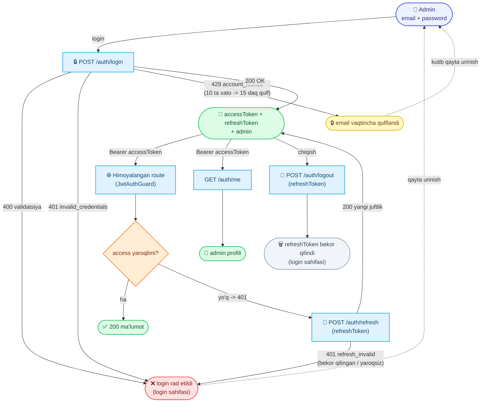

# Admin: Login

Admin panel uchun autentifikatsiya hujjati.

Adminlar **email + parol** bilan kiradi (clientlardagi OTP flow'dan butunlay alohida). Admin tokenlari client endpointlarida ishlamaydi va aksincha.

Base URL: `https://api.fixleo.com/api/v1`

> **Til:** barcha `message` (va validatsiya `errors[].message`) `Accept-Language` (uz / ru / en) bo'yicha tarjimalanadi — misollarda inglizcha keltirilgan. Javob/xato formati va umumiy qoidalar: `Backend Config for client.md`.

Barcha javoblar standart konvertda:

```json
{ "success": true, "message": "...", "data": {} }
```

## 🔄 Jarayon sxemasi (workflow)



---

## 1. Login

`POST /auth/login`

**Request:**

```json
{
  "email": "admin@fixleo.local",
  "password": "ChangeMe_Admin123"
}
```

**Response `200`:**

```json
{
  "success": true,
  "message": "Login successful",
  "data": {
    "accessToken": "eyJhbGciOi...",
    "refreshToken": "eyJhbGciOi...",
    "admin": {
      "id": "#Admin-1",
      "email": "admin@fixleo.local",
      "fullname": "Super Admin",
      "role": "superadmin",
      "createdAt": "2026-06-08T10:00:00.000Z",
      "updatedAt": "2026-06-08T10:00:00.000Z"
    }
  }
}
```

**Xatolar:**

| Kod | Sabab                                            | Message                              |
| --- | ------------------------------------------------ | ------------------------------------ |
| 400 | Email formati noto'g'ri / parol 8 belgidan qisqa | validatsiya xabari                   |
| 401 | Email yoki parol noto'g'ri                       | `Invalid email or password`          |
| 429 | Email qulflangan (10 ta xato parol)              | `Too many attempts — try again in {seconds}s` |
| 429 | IP bo'yicha so'rovlar limiti oshib ketdi         | `Too many requests — try again in {seconds}s` |

> Xavfsizlik: 401 xabari qaysi maydon xato ekanini ataylab aytmaydi.

### Brute-force himoyasi (Redis)

- **Email qulfi:** bir email uchun **10 ta** noto'g'ri parol urinishidan so'ng email **15 daqiqaga** qulflanadi. Bu paytda login `429 account_locked` qaytaradi (`seconds` — qancha kutish kerakligini ko'rsatadi). Muvaffaqiyatli login hisoblagichni tozalaydi.
- **IP budjeti:** barcha `auth` endpointlari (login / refresh / logout / me) bir IP uchun **daqiqasiga 30 so'rov** bilan cheklangan; oshib ketsa `429 too_many_requests`.

Ikkala limit ham Redis'da saqlanadi (multi-instance to'g'ri ishlaydi).

---

## 2. Tokenlardan foydalanish

Himoyalangan endpointlarga:

```
Authorization: Bearer <accessToken>
```

| Token          | Muddati   | Vazifasi         |
| -------------- | --------- | ----------------------------------------------- |
| `accessToken`  | 15 daqiqa | Har bir so'rovda                                |
| `refreshToken` | 7 kun     | Yangilash uchun (logout'da bekor qilsa bo'ladi) |

### Token yangilash

`POST /auth/refresh`

```json
{ "refreshToken": "eyJhbGciOi..." }
```

**Response `200`:** yangi token juftligi. `401` kelsa — login sahifasiga qaytaring.

**Xatolar:**

| Kod | Sabab                                                   | Message                            |
| --- | ------------------------------------------------------- | ---------------------------------- |
| 401 | Refresh token yaroqsiz, muddati o'tgan **yoki logout qilingan** (bekor qilingan) | `Invalid or expired refresh token` |
| 429 | IP bo'yicha so'rovlar limiti oshib ketdi                | `Too many requests — try again in {seconds}s` |

> Logout qilingan refreshToken Redis "blacklist"ga tushadi — keyingi `/auth/refresh` urinishi `401 refresh_invalid` qaytaradi.

### Logout

`POST /auth/logout`

```json
{ "refreshToken": "eyJhbGciOi..." }
```

Berilgan refreshTokenni **bekor qiladi** (Redis blacklist): undan keyin u bilan `/auth/refresh` ishlamaydi (`401`). Access token amal qilish muddati tugaguncha (15 daqiqa) o'z-o'zidan eskiradi — alohida bekor qilinmaydi, shuning uchun mijoz tokenlarni o'chirib tashlashi kerak.

Amaliyot **idempotent**: yaroqsiz / muddati o'tgan / allaqachon bekor qilingan token yuborilsa ham `200` qaytadi.

**Response `200`:**

```json
{
  "success": true,
  "message": "Logged out",
  "data": null
}
```

**Xatolar:**

| Kod | Sabab                                    | Message                            |
| --- | ---------------------------------------- | ---------------------------------- |
| 400 | `refreshToken` JWT formatida emas        | validatsiya xabari                 |
| 429 | IP bo'yicha so'rovlar limiti oshib ketdi | `Too many requests — try again in {seconds}s` |

### Profil

`GET /auth/me` (Bearer token bilan)

**Response `200`:** yuqoridagi `admin` obyekti.

---

## Rollar

| Rol          | Huquqlar                                         |
| ------------ | ------------------------------------------------ |
| `superadmin` | Hamma narsa (barcha rol tekshiruvlaridan o'tadi) |
| `admin`      | Oddiy admin huquqlari                            |

Backend'da yangi route himoyalash:

```ts
@UseGuards(JwtAuthGuard, RolesGuard)
@Roles(AdminRole.superadmin)
```

## Default superadmin

Birinchi ishga tushishda `.env` dagi qiymatlardan avtomatik yaratiladi (mavjud bo'lsa qayta yaratilmaydi):

```env
DEFAULT_ADMIN_EMAIL=admin@fixleo.local
DEFAULT_ADMIN_PASSWORD=ChangeMe_Admin123
DEFAULT_ADMIN_FULLNAME=Super Admin
```

> Production'da parol va JWT secretlarni albatta almashtiring.

## ID formati

Admin ID'lari ketma-ket: `#Admin-1`, `#Admin-2`, ...

Swagger: `https://api.fixleo.com/api/docs` ("Auth" bo'limi).
