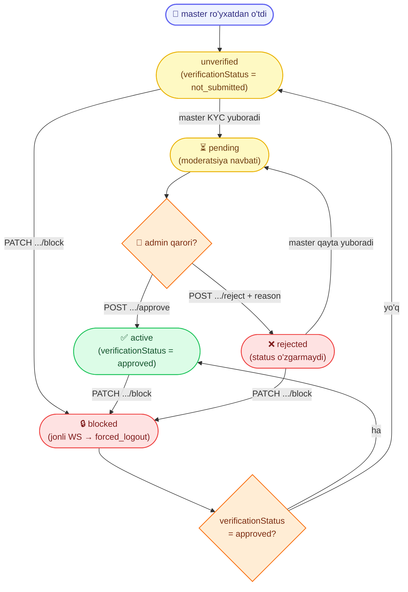

# Admin: Masterlar va KYC verifikatsiya

Admin panel uchun **masterlarni boshqarish** va **KYC moderatsiyasi** hujjati — masterlar ro'yxati/ko'rish, block/unblock hamda verifikatsiya navbati (tasdiqlash / rad etish).

Base URL: `https://api.fixleo.com/api/v1`

> **Til:** barcha `message` (va validatsiya `errors[].message`) `Accept-Language` (uz / ru / en) bo'yicha tarjimalanadi — misollarda inglizcha keltirilgan. Umumiy format/qoidalar: `Backend Config for client.md`.

Barcha route'lar **admin token** talab qiladi (`admin` yoki `superadmin`) — qarang `AdminLogin.md`:

```
Authorization: Bearer <admin accessToken>
```

Client/master tokeni bu endpointlarda **ishlamaydi** (`401`).

Barcha javoblar standart konvertda:

```json
{ "success": true, "message": "...", "data": {} }
```

Xatolar:

```json
{ "success": false, "message": "...", "statusCode": 404, "path": "...", "timestamp": "...", "requestId": "..." }
```

> **Korrelyatsiya:** har bir javobda `X-Request-Id` header bo'ladi va xato konvertida shu qiymat `requestId` maydonida qaytadi — log/diagnostika uchun ishlatiladi.

> **`:id` haqida:** path parametri sifatida **raqamli** DB id ishlatiladi (masalan masterda `1`, verifikatsiyada `88` — ya'ni `#V-88`'dagi raqam). Javoblarda esa public id qaytadi: master `#M-00000000001`, verifikatsiya `#V-88`.

> **Audit log:** ushbu hujjatdagi barcha **moderatsiya amallari** — block / unblock / approve / reject (ya'ni har bir admin-token bilan bajarilgan mutating `POST`/`PATCH` so'rov) — admin audit logiga yoziladi (admin id/email, method, path, status, `requestId`). Qarang `AdminAuditLog.md`.

---

## 🔄 Jarayon sxemasi (workflow)

Master `status` (account holati) va `verificationStatus` (KYC holati) admin amallari bilan qanday o'zgaradi:



> `reject` masterning **account** holatini o'zgartirmaydi — faqat `verificationStatus` -> `rejected` bo'ladi, shuning uchun master hujjatni tuzatib qayta yuborishi mumkin.

---

## DTO'lar

**MasterResponseDto** (master profili):

| Maydon               | Turi                                                | Izoh                                              |
| -------------------- | --------------------------------------------------- | ------------------------------------------------- |
| `id`                 | string                                              | Public id, `#M-00000000001`                       |
| `phone`              | string                                              | `+998901234567`                                   |
| `name`               | string \| null                                      | Onboarding'gacha `null`                           |
| `city`               | string \| null                                      |                                                   |
| `experienceYears`    | number \| null                                      |                                                   |
| `bio`                | string \| null                                      |                                                   |
| `avatarUrl`          | string \| null                                      |                                                   |
| `status`             | `unverified` \| `active` \| `blocked`               | Account holati                                    |
| `verificationStatus` | `not_submitted` \| `pending` \| `approved` \| `rejected` | KYC holati                                   |
| `latitude`           | number \| null                                      |                                                   |
| `longitude`          | number \| null                                      |                                                   |
| `workRadiusKm`       | number \| null                                      | Ish radiusi (km)                                  |
| `categories`         | `{ id, name }[]`                                     | Master tanlagan xizmat yo'nalishlari              |
| `createdAt`          | string                                              | ISO sana                                          |
| `updatedAt`          | string                                              | ISO sana                                          |

**VerificationListItem** (navbatdagi qator): `id` (`#V-88`), `status`, `submittedAt`, `master { id, name, phone, city, categories[] }`.

**VerificationDetail** (`VerificationListItem` + qo'shimcha):

| Maydon            | Turi                                                                                   | Izoh                                            |
| ----------------- | -------------------------------------------------------------------------------------- | ----------------------------------------------- |
| `documents`       | `DocumentDto[]`                                                                         | Presigned URL bilan (5 daqiqa amal qiladi)      |
| `checklist`       | `{ documentReadable, photoMatchesSelfie, dataMatchesForm }` — har biri `bool \| null`  | Moderator chek-listi                            |
| `rejectionReason` | string \| null                                                                         | Rad etilgan bo'lsa sabab                        |
| `decidedAt`       | string \| null                                                                         | Qaror qabul qilingan vaqt                       |

**DocumentDto:** `{ id, type, mimeType, sizeBytes, url, createdAt, updatedAt }`. `type`: `oneid` | `passport_front` | `passport_back` | `selfie_with_passport`.

---

# A) Masterlar

## 1. Masterlar ro'yxati

`GET /admin/masters`

Sahifalangan (paginated) ro'yxat. Ixtiyoriy qidiruv va status filtrlari bilan.

**Query parametrlari:**

| Param                | Turi   | Default | Izoh                                                                |
| -------------------- | ------ | ------- | ------------------------------------------------------------------ |
| `page`               | number | `1`     | Sahifa raqami (1 dan boshlanadi)                                   |
| `limit`              | number | `20`    | Sahifadagi elementlar soni (maksimum `100`)                        |
| `search`             | string | —       | Telefon yoki ism bo'yicha qidiruv (katta-kichik harf farqsiz)      |
| `status`             | enum   | —       | `unverified` \| `active` \| `blocked`                              |
| `verificationStatus` | enum   | —       | `not_submitted` \| `pending` \| `approved` \| `rejected`           |

**Misol:** `GET /admin/masters?page=1&limit=10&search=99893&verificationStatus=pending`

**Response `200`:**

```json
{
  "success": true,
  "message": "Masters list",
  "data": {
    "items": [
      {
        "id": "#M-00000000001",
        "phone": "+998933456789",
        "name": "Сергей Ким",
        "city": "Ташкент",
        "experienceYears": 5,
        "bio": "Опытный сантехник, работаю аккуратно.",
        "avatarUrl": null,
        "status": "active",
        "verificationStatus": "approved",
        "latitude": 41.311081,
        "longitude": 69.240562,
        "workRadiusKm": 5,
        "categories": [{ "id": 1, "name": "Сантехника" }],
        "createdAt": "2026-06-14T00:00:00.000Z",
        "updatedAt": "2026-06-14T00:00:00.000Z"
      }
    ],
    "meta": { "total": 42, "page": 1, "limit": 10, "totalPages": 5 }
  }
}
```

**Xatolar:**

| Kod | Sabab                       | Izoh                          |
| --- | --------------------------- | ----------------------------- |
| 400 | Query validatsiyadan o'tmadi | Noto'g'ri `page`/`limit`/enum |
| 401 | Token yo'q / noto'g'ri       | `Access token is missing`     |
| 403 | Yetarli huquq yo'q           | `Insufficient permissions`    |

---

## 2. Bitta masterni ko'rish

`GET /admin/masters/:id`

Raqamli id (masalan `1`).

**Response `200`:**

```json
{
  "success": true,
  "message": "Master details",
  "data": {
    "id": "#M-00000000001",
    "phone": "+998933456789",
    "name": "Сергей Ким",
    "city": "Ташкент",
    "experienceYears": 5,
    "bio": "Опытный сантехник, работаю аккуратно.",
    "avatarUrl": null,
    "status": "active",
    "verificationStatus": "approved",
    "latitude": 41.311081,
    "longitude": 69.240562,
    "workRadiusKm": 5,
    "categories": [{ "id": 1, "name": "Сантехника" }],
    "createdAt": "2026-06-14T00:00:00.000Z",
    "updatedAt": "2026-06-14T00:00:00.000Z"
  }
}
```

**Xatolar:**

| Kod | Sabab            | Izoh                    |
| --- | ---------------- | ----------------------- |
| 404 | Master topilmadi | `Master #1 not found`   |

---

## 3. Masterni bloklash

`PATCH /admin/masters/:id/block`

`status`ni `blocked`ga o'rnatadi. Sabab ixtiyoriy — bloklangan master kirishga urinsa shu sabab ko'rinadi.

**Request:**

```json
{ "reason": "Fraud suspicion" }
```

| Maydon   | Majburiy | Qoidalar                          |
| -------- | -------- | --------------------------------- |
| `reason` | ❌       | Matn (maksimum belgi cheklovi bor) |

**Response `200`:** yangilangan `master` obyekti (`"message": "Master blocked"`, `status: "blocked"`).

> **Realtime:** master bloklanganda uning **ochiq WebSocket** sessiyalari ham majburan uziladi — serverga ulangan socketga `forced_logout` (`{ reason: "account_blocked" }`) eventi yuboriladi va socket disconnect qilinadi (Redis adapter orqali barcha instanslarda). Bloklangan master jonli realtime kanalni ushlab tura olmaydi — qarang `Realtime.md`.

**Xatolar:**

| Kod | Sabab            | Izoh                  |
| --- | ---------------- | --------------------- |
| 404 | Master topilmadi | `Master #1 not found` |

---

## 4. Masterni blokdan chiqarish

`PATCH /admin/masters/:id/unblock`

Body kerak emas. Status tiklanadi:

- verifikatsiya `approved` bo'lsa → `active`
- aks holda → `unverified`

**Response `200`:** yangilangan `master` obyekti (`"message": "Master unblocked"`).

**Xatolar:**

| Kod | Sabab            | Izoh                  |
| --- | ---------------- | --------------------- |
| 404 | Master topilmadi | `Master #1 not found` |

---

# B) Verifikatsiya (KYC moderatsiya)

Figma "Верификация" ekrani — masterlar yuborgan hujjatlarni ko'rib chiqish navbati.

## 5. Verifikatsiya navbati

`GET /admin/verifications`

Sahifalangan navbat. Eng eskisi birinchi (oldest-first) — moderator tartib bilan ko'rib chiqadi.

**Query parametrlari:**

| Param    | Turi   | Default     | Izoh                                                     |
| -------- | ------ | ----------- | -------------------------------------------------------- |
| `page`   | number | `1`         | Sahifa raqami                                            |
| `limit`  | number | `20`        | Sahifadagi soni (maksimum `100`)                        |
| `status` | enum   | `pending`   | `pending` \| `approved` \| `rejected`                   |

**Misol:** `GET /admin/verifications?status=pending&page=1`

**Response `200`:**

```json
{
  "success": true,
  "message": "Verifications",
  "data": {
    "items": [
      {
        "id": "#V-88",
        "status": "pending",
        "submittedAt": "2026-06-14T00:00:00.000Z",
        "master": {
          "id": "#M-00000000001",
          "name": "Сергей Ким",
          "phone": "+998933456789",
          "city": "Ташкент",
          "categories": [{ "id": 1, "name": "Сантехника" }]
        }
      }
    ],
    "meta": { "total": 7, "page": 1, "limit": 20, "totalPages": 1 }
  }
}
```

**Xatolar:**

| Kod | Sabab                       | Izoh                       |
| --- | --------------------------- | -------------------------- |
| 400 | Query validatsiyadan o'tmadi | Noto'g'ri `status`/`page`  |
| 401 | Token yo'q / noto'g'ri       | `Access token is missing`  |
| 403 | Yetarli huquq yo'q           | `Insufficient permissions` |

---

## 6. Verifikatsiyani ko'rish

`GET /admin/verifications/:id`

Raqamli id (`#V-88` → `88`). Master ma'lumotlari + KYC hujjatlari (presigned URL) + chek-list/qaror.

**Response `200`:**

```json
{
  "success": true,
  "message": "Verification details",
  "data": {
    "id": "#V-88",
    "status": "pending",
    "submittedAt": "2026-06-14T00:00:00.000Z",
    "master": {
      "id": "#M-00000000001",
      "name": "Сергей Ким",
      "phone": "+998933456789",
      "city": "Ташкент",
      "categories": [{ "id": 1, "name": "Сантехника" }]
    },
    "documents": [
      {
        "id": 1,
        "type": "passport_front",
        "mimeType": "image/jpeg",
        "sizeBytes": 245678,
        "url": "http://localhost:9000/fixleo/masters/1/passport_front-...jpg?X-Amz-...",
        "createdAt": "2026-06-14T00:00:00.000Z",
        "updatedAt": "2026-06-14T00:00:00.000Z"
      }
    ],
    "checklist": {
      "documentReadable": null,
      "photoMatchesSelfie": null,
      "dataMatchesForm": null
    },
    "rejectionReason": null,
    "decidedAt": null
  }
}
```

> Hujjat `url`lari **qisqa muddatli** presigned havolalar (5 daqiqa). Ko'rib chiqayotganda yangidan oching.

**Xatolar:**

| Kod | Sabab                  | Izoh                          |
| --- | ---------------------- | ----------------------------- |
| 404 | Verifikatsiya topilmadi | `Verification #88 not found`  |

---

## 7. Tasdiqlash (Одобрить)

`POST /admin/verifications/:id/approve`

Moderator chek-listini saqlaydi, arizani `approved` qiladi va masterni faollashtiradi (`status` → `active`, `verificationStatus` → `approved`).

**Request** (chek-list — barchasi ixtiyoriy):

```json
{
  "documentReadable": true,
  "photoMatchesSelfie": true,
  "dataMatchesForm": true
}
```

| Maydon               | Majburiy | Qoidalar           |
| -------------------- | -------- | ------------------ |
| `documentReadable`   | ❌       | boolean            |
| `photoMatchesSelfie` | ❌       | boolean            |
| `dataMatchesForm`    | ❌       | boolean            |

**Response `200`:** to'liq `VerificationDetail` (`"message": "Verification approved"`, `status: "approved"`, `decidedAt` to'ldirilgan).

> Bu amal audit logiga yoziladi (`AdminAuditLog.md`). Qaror masterning ilovasiga realtime yuboriladi (`Realtime.md`).

**Xatolar:**

| Kod | Sabab                          | Izoh                              |
| --- | ------------------------------ | --------------------------------- |
| 404 | Verifikatsiya topilmadi         | `Verification #88 not found`      |
| 409 | Ariza `pending` holatida emas   | `This verification is not pending` |

---

## 8. Rad etish (Отклонить)

`POST /admin/verifications/:id/reject`

Arizani `rejected` qiladi, master `verificationStatus`ini `rejected`ga o'tkazadi (master keyin **qayta yuborishi** mumkin). Sabab majburiy.

**Request:**

```json
{
  "reason": "Passport photo is blurry",
  "documentReadable": false,
  "photoMatchesSelfie": false,
  "dataMatchesForm": false
}
```

| Maydon               | Majburiy | Qoidalar                              |
| -------------------- | -------- | ------------------------------------- |
| `reason`             | ✅       | Bo'sh bo'lmasligi shart (maksimum belgi cheklovi bor) |
| `documentReadable`   | ❌       | boolean                               |
| `photoMatchesSelfie` | ❌       | boolean                               |
| `dataMatchesForm`    | ❌       | boolean                               |

**Response `200`:** to'liq `VerificationDetail` (`"message": "Verification rejected"`, `status: "rejected"`, `rejectionReason` to'ldirilgan).

> Bu amal audit logiga yoziladi (`AdminAuditLog.md`). Qaror masterning ilovasiga realtime yuboriladi (`Realtime.md`).

**Xatolar:**

| Kod | Sabab                          | Izoh                              |
| --- | ------------------------------ | --------------------------------- |
| 400 | `reason` berilmagan/bo'sh       | validatsiya xabari (`errors[]`)   |
| 404 | Verifikatsiya topilmadi         | `Verification #88 not found`      |
| 409 | Ariza `pending` holatida emas   | `This verification is not pending` |

---

## Umumiy xatolar

| Kod | Sabab                                       | Izoh                              |
| --- | ------------------------------------------- | --------------------------------- |
| 400 | Request body / query validatsiyadan o'tmadi | validatsiya xabari (`errors[]`)   |
| 401 | Token yo'q                                  | `Access token is missing`         |
| 401 | Token noto'g'ri / eskirgan                  | `Invalid or expired access token` |
| 401 | Noto'g'ri token turi                        | `Invalid token type`              |
| 403 | Yetarli huquq yo'q                          | `Insufficient permissions`        |
| 404 | Master topilmadi                            | `Master #<id> not found`          |
| 404 | Verifikatsiya topilmadi                     | `Verification #<id> not found`    |
| 409 | Ariza pending emas                          | `This verification is not pending` |

---

## Endpointlar xulosasi

| Method  | Route                              | Vazifa                  | Message                 |
| ------- | ---------------------------------- | ----------------------- | ----------------------- |
| `GET`   | `/admin/masters`                   | Ro'yxat (filter + page) | `Masters list`          |
| `GET`   | `/admin/masters/:id`               | Bitta master            | `Master details`        |
| `PATCH` | `/admin/masters/:id/block`         | Bloklash                | `Master blocked`        |
| `PATCH` | `/admin/masters/:id/unblock`       | Blokdan chiqarish       | `Master unblocked`      |
| `GET`   | `/admin/verifications`             | Navbat (pending default)| `Verifications`         |
| `GET`   | `/admin/verifications/:id`         | Verifikatsiya detali    | `Verification details`  |
| `POST`  | `/admin/verifications/:id/approve` | Tasdiqlash              | `Verification approved` |
| `POST`  | `/admin/verifications/:id/reject`  | Rad etish               | `Verification rejected` |

Swagger: `https://api.fixleo.com/api/docs` ("Admin: Masters" va "Admin: Verifications" bo'limlari).
