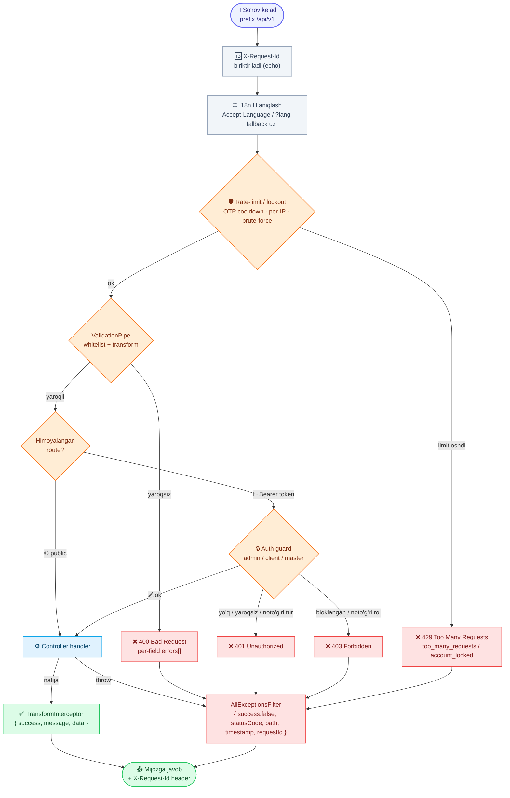

# Backend Config for Client

Frontend / mobile developerlar uchun **umumiy backend shartnomasi (contract)** — barcha endpointlarga taalluqli qoidalar: javob formatlari, xatolar, til (Accept-Language), autentifikatsiya va umumiy konvensiyalar.

> Har bir modulning o'z hujjati bor — `AdminLogin.md`, `AdminClients.md`, `LoginOrRegisterClient.md`, `Categories.md`, `WorkRadius.md`, `MasterRegister.md`, `AdminMasters.md`, `AdminAuditLog.md`, `Realtime.md`. Bu fayl — ularning **barchasiga** umumiy bo'lgan qism.

---

## Base URL

```
https://api.fixleo.com/api/v1
```

Barcha endpointlar **`/api/v1`** prefiksi bilan boshlanadi (API versiyalash URI orqali — buzuvchi o'zgarishlar kelajakda `/api/v2` ostida chiqadi, v1 mijozlarga tegmaydi).

**Istisno — versiyaga bog'liq emas (no `/v1`):** infratuzilma/ops probelar:

```
GET  https://api.fixleo.com/api/health     ← health/readiness probe
GET  https://api.fixleo.com/api/metrics    ← Prometheus metrikalar (ops)
     https://api.fixleo.com/api/docs        ← Swagger (interaktiv hujjat)
```

---

## Javob formati (standart konvert)

**Har bir** javob — muvaffaqiyatli ham, xato ham — bir xil konvertda qaytadi.

### ✅ Muvaffaqiyat

```json
{
  "success": true,
  "message": "Kategoriyalar ro'yxati",
  "data": { }
}
```

| Maydon    | Turi    | Izoh                                                          |
| --------- | ------- | ------------------------------------------------------------ |
| `success` | boolean | Doim `true`                                                  |
| `message` | string  | Foydalanuvchiga ko'rsatish mumkin bo'lgan xabar (tarjimalangan — pastga qarang) |
| `data`    | any     | Foydali yuk (obyekt, massiv yoki `null`)                     |

`data` formatlari endpointga bog'liq: bitta obyekt, massiv yoki sahifalangan ro'yxat (`{ items, meta }`).

### ❌ Xato

```json
{
  "success": false,
  "message": "#999 kategoriya topilmadi",
  "statusCode": 404,
  "path": "/api/v1/categories/999",
  "timestamp": "2026-06-14T03:20:17.717Z",
  "requestId": "0f1c2d3e-4a5b-6c7d-8e9f-0a1b2c3d4e5f"
}
```

| Maydon       | Turi     | Izoh                                                         |
| ------------ | -------- | ----------------------------------------------------------- |
| `success`    | boolean  | Doim `false`                                                |
| `message`    | string   | Tarjimalangan xato xabari (foydalanuvchiga ko'rsatish mumkin) |
| `statusCode` | number   | HTTP status kodi                                            |
| `path`       | string   | So'rov yo'li                                                |
| `timestamp`  | string   | ISO-8601 vaqt belgisi                                       |
| `requestId`  | string   | So'rovning korrelyatsiya ID'si — `X-Request-Id` javob header'i bilan **bir xil** qiymat. Xatoni qo'llab-quvvatlashga (support) yuborganda shu ID'ni ko'rsating |
| `errors`     | `{ field, message }[]` | **Faqat `400` validatsiya xatolarida** — har bir maydon uchun alohida xato |

> **`X-Request-Id` (har bir javobda):** muvaffaqiyatli va xato javoblarning **barchasi** `X-Request-Id` header bilan qaytadi. Agar so'rovda `X-Request-Id` yuborsangiz — backend o'shani qayta ishlatadi, bo'lmasa yangisini hosil qiladi. Xato konvertidagi `requestId` ham aynan shu qiymat — loglar bilan bog'lash uchun ishlatiladi.

### Validatsiya xatosi (`400`)

`message` — umumiy, tarjimalangan sarlavha; `errors` — **har bir maydon uchun alohida**, tarjimalangan xabar (`{ field, message }`):

```json
{
  "success": false,
  "message": "Validatsiya xatosi",
  "statusCode": 400,
  "path": "/api/v1/clients/auth/register",
  "timestamp": "2026-06-14T03:19:53.816Z",
  "requestId": "0f1c2d3e-4a5b-6c7d-8e9f-0a1b2c3d4e5f",
  "errors": [
    { "field": "name",  "message": "Majburiy maydon" },
    { "field": "phone", "message": "Telefon xalqaro formatda bo'lishi kerak, masalan +998901234567" },
    { "field": "code",  "message": "Kod 4 ta raqamdan iborat bo'lishi kerak" }
  ]
}
```

> `field` — qaysi maydon xato, `message` — tarjimalangan (Accept-Language) sabab. Formada **o'sha maydon ostida** ko'rsating. Bo'sh/yuborilmagan maydon → `"Majburiy maydon"`; qisqa qiymat → `"Kamida {n} ta belgi bo'lishi kerak"` va h.k.

---

## 🔄 Jarayon sxemasi (workflow)

Har bir so'rov bir xil "lifecycle" dan o'tadi: til aniqlanadi → validatsiya → guard/handler → javob konvertga o'raladi; xato bo'lsa — global filtr bir xil xato konvertini qaytaradi.



> Uchta subyekt — **admin** (email + parol), **client** va **master** (telefon + OTP) — har biri o'z tokeniga ega; tokenlar bir-birining endpointlarida ishlamaydi (`403`).

---

## 🌐 Til (Accept-Language)

Backend javoblardagi **`message`** matnini so'rovning tiliga moslab qaytaradi.

### Qo'llab-quvvatlanadigan tillar

| Kod  | Til       |
| ---- | --------- |
| `uz` | O'zbekcha |
| `ru` | Ruscha    |
| `en` | Inglizcha |

### Qanday yuboriladi

Har bir so'rovda **`Accept-Language`** header qo'shing:

```
Accept-Language: uz
```

- Regional variantlar ham ishlaydi: `ru-RU`, `en-US`, `uz-UZ` → mos til.
- Sifat (quality) qiymatlari hisobga olinadi: `Accept-Language: uz,ru;q=0.8`.
- Muqobil (test/debug uchun): `?lang=ru` query parametri.

### Fallback

Agar `Accept-Language` yuborilmasa yoki noma'lum til bo'lsa — **`uz`** (default) ishlatiladi.

### Bir xil xato, uch tilda

```
GET /api/categories/999

Accept-Language: uz  →  { "message": "#999 kategoriya topilmadi", ... }
Accept-Language: ru  →  { "message": "Категория #999 не найдена", ... }
Accept-Language: en  →  { "message": "Category #999 not found", ... }
```

> **Tavsiya:** frontend/mobile har bir so'rovga `Accept-Language` ni avtomatik qo'shsin (axios/fetch interceptor orqali), foydalanuvchi tanlagan tilga qarab.

> **Eslatma:** asosiy `message` ham, validatsiyaning **har bir maydon** uchun `errors[].message` ham tarjimalanadi (uz/ru/en).

---

## 🔑 Autentifikatsiya

Himoyalangan endpointlarga **Bearer token** kerak:

```
Authorization: Bearer <accessToken>
```

Tizimda **uch xil** subyekt va token bor — ular bir-birining endpointlarida **ishlamaydi**:

| Subyekt    | Qanday kiradi          | Token oladi               | Hujjat                     |
| ---------- | ---------------------- | ------------------------- | -------------------------- |
| **Admin**  | email + parol          | `POST /auth/login`        | `AdminLogin.md`            |
| **Client** | telefon + SMS OTP      | `POST /clients/auth/...`  | `LoginOrRegisterClient.md` |
| **Master** | telefon + SMS OTP      | `POST /masters/auth/...`  | `MasterRegister.md`        |

- `accessToken` — qisqa muddatli (15 daqiqa), har so'rovda yuboriladi.
- `refreshToken` — uzoqroq (access eskirganda yangilash uchun).
- Token yo'q/eskirgan → `401`. Ruxsat yetmasa → `403`. Token turi (admin/client/master) bir-birinikida **ishlamaydi**.
- **Bloklangan client/master** har qanday so'rovda `403` oladi (amaldagi token bilan ham) — har request'da bazadan tekshiriladi.

### Logout (refresh token'ni bekor qilish)

Har bir subyekt uchun logout endpoint bor. Body'da `refreshToken` yuboriladi; backend o'sha refresh token'ni **bekor qiladi** (revoke) — bu token endi `/refresh` da yangi access token chiqarib bera olmaydi. Amal **idempotent** (bir nechta marta chaqirsa ham xato bermaydi), javobi `success.logout`.

| Subyekt    | Endpoint                       | Body              |
| ---------- | ------------------------------ | ----------------- |
| **Admin**  | `POST /auth/logout`            | `{ refreshToken }` |
| **Client** | `POST /clients/auth/logout`    | `{ refreshToken }` |
| **Master** | `POST /masters/auth/logout`    | `{ refreshToken }` |

```json
// POST /api/v1/clients/auth/logout   { "refreshToken": "<...>" }
{ "success": true, "message": "Tizimdan chiqildi", "data": null }
```

- Logout qilingan (bekor qilingan) `refreshToken` bilan `/refresh` ga murojaat → **`401`** (Redis blacklist orqali, token o'zining tabiiy muddati tugaguncha bloklanadi).
- `accessToken` qisqa muddatli bo'lgani uchun logout'da alohida bekor qilinmaydi — u 15 daqiqada o'zi eskiradi; ilova logout'da ikkala tokenni ham o'chirib tashlasin.

---

## HTTP status kodlari

| Kod   | Ma'nosi                  | Qachon                                       |
| ----- | ------------------------ | -------------------------------------------- |
| `200` | OK                       | Muvaffaqiyatli GET / PATCH / PUT / DELETE    |
| `201` | Created                  | Muvaffaqiyatli POST (yangi resurs)           |
| `400` | Bad Request              | Validatsiya xatosi (`errors[]` bilan)        |
| `401` | Unauthorized             | Token yo'q / noto'g'ri / eskirgan            |
| `403` | Forbidden                | Ruxsat yetmaydi / account bloklangan         |
| `404` | Not Found                | Resurs topilmadi                             |
| `409` | Conflict                 | Unikal qoida buzildi (masalan telefon band)  |
| `429` | Too Many Requests        | Rate-limit / lockout — OTP cooldown, urinishlar ko'p, per-IP byudjet (pastga qarang) |
| `500` | Internal Server Error    | Kutilmagan server xatosi                     |
| `503` | Service Unavailable      | **Faqat `GET /api/health`** — bog'liqliklardan (DB / Redis / storage) biri ishlamayapti |

---

## 🛡️ Rate limiting / abuse himoyasi

SMS-bombing, brute-force va replay'ning oldini olish uchun maxsus auth endpointlar Redis bilan cheklanadi. Limit oshganda → **`429 Too Many Requests`**, `message` tarjimalangan va qancha **soniya** kutish kerakligini ko'rsatadi (`{seconds}`). Ilova `429` ni alohida ushlab, foydalanuvchiga "yana N soniyadan keyin" deb ko'rsatsin.

| Holat                          | Cheklov                                        | Natija                                   |
| ------------------------------ | ---------------------------------------------- | ---------------------------------------- |
| **OTP yuborish (telefon bo'yicha)** | har telefon: **1/daqiqa** (cooldown) + **5/soat** (cap) | `429` · `errors.too_many_requests {seconds}` |
| **OTP tekshirish (telefon bo'yicha)** | **5** marta noto'g'ri kod → **15 daqiqa** qulflanadi | `429` · `errors.account_locked {seconds}` |
| **Admin login (email bo'yicha)** | **10** marta noto'g'ri parol → **15 daqiqa** qulflanadi | `429` · `errors.account_locked {seconds}` |
| **Per-IP byudjet (auth endpointlar)** | IP bo'yicha **30/daqiqa** (auth controllerlar) | `429` · `errors.too_many_requests {seconds}` |

- **OTP yuborish:** `send-otp` va `resend-otp` bir xil cooldown'ga bo'ysunadi — `resend-otp` shunchaki `send-otp` aliasi (1/daqiqa, 5/soat).
- **Qulf (lockout)** muvaffaqiyatli kirishda tozalanadi (to'g'ri OTP / to'g'ri parol → hisoblagich reset bo'ladi).
- **`{seconds}`** — qulf/cooldown tugashiga qolgan vaqt; `0` bo'lsa qayta urinish mumkin.

```json
// 429 — OTP'ni juda tez qayta so'radi
{
  "success": false,
  "message": "So'rovlar juda ko'p — 47 soniyadan keyin urinib ko'ring",
  "statusCode": 429,
  "path": "/api/v1/clients/auth/send-otp",
  "timestamp": "2026-06-16T09:00:00.000Z",
  "requestId": "0f1c2d3e-4a5b-6c7d-8e9f-0a1b2c3d4e5f"
}
```

---

## Umumiy qoidalar

- **Content-Type:** so'rov tanasi (body) bo'lsa — `application/json`.
- **Noma'lum maydonlar** rad etiladi: body'da DTO'da yo'q maydon yuborilsa → `400`.
- **Telefon formati:** xalqaro, `+` bilan — `+998901234567` (bo'shliq/defis backend tomonidan tozalanadi).
- **ID formatlari** (javoblarda public id; admin `:id` path'larida **raqamli** id ishlatiladi, masalan `3`):
  - Client: `#U-00000000001`
  - Master: `#M-00000000001`
  - Admin: `#Admin-1`
  - Verification (KYC ariza): `#V-88`
  - Category: oddiy raqamli (`1`)
- **Sahifalash (pagination):** ro'yxat endpointlari `{ items: [...], meta: { total, page, limit, totalPages } }` qaytaradi. `?page=` va `?limit=` (maksimum `100`) bilan boshqariladi.
- **Health check:** `GET /api/health` (versiyaga bog'liq emas, auth talab qilmaydi) — uchchala bog'liqlikni: **DB + Redis + object storage (MinIO)** ni tekshiradi. Hammasi ishlasa → **`200`** (`status: "ok"`), aks holda → **`503`** (`status: "error"`). Body'da har bir bog'liqlik uchun alohida maydon bor: `database`, `redis`, `storage` (har biri `{ status: "up" | "down", latencyMs }`).
- **Metrikalar (ops):** `GET /api/metrics` (versiyaga bog'liq emas) — Prometheus formatidagi metrikalar. Bu endpoint monitoring/ops uchun, mijoz ilovasi uchun emas.
- **Admin audit:** admin tomonidan bajarilgan har bir **o'zgartiruvchi** so'rov (POST/PATCH/PUT/DELETE) audit jurnaliga yoziladi; `GET /api/v1/admin/audit-logs` (faqat admin) bilan ko'rish mumkin — batafsil `AdminAuditLog.md`.

---

## Frontend uchun qisqa eslatma (checklist)

- [ ] Base URL: `https://api.fixleo.com/api/v1`
- [ ] Har so'rovga `Accept-Language` qo'shing (uz / ru / en)
- [ ] Body bo'lsa `Content-Type: application/json`
- [ ] Himoyalangan so'rovlarga `Authorization: Bearer <token>`
- [ ] Javobni `success` bo'yicha tekshiring; xatoda `message` ni ko'rsating, `errors[]` ni maydonlarga bog'lang
- [ ] `401` da → token yangilang (`refresh`), bo'lmasa login flow'ga qaytaring (logout qilingan refresh token → `401`, qayta login kerak)
- [ ] `429` da → `message` ni ko'rsating va `{seconds}` tugaguncha qayta urinmang (OTP cooldown / lockout)
- [ ] Logout'da → mos `.../logout` ga `{ refreshToken }` yuboring va ikkala tokenni ham o'chiring
- [ ] Xato bo'lsa `requestId` (yoki `X-Request-Id` header) ni saqlang — support'ga murojaatda foydali
