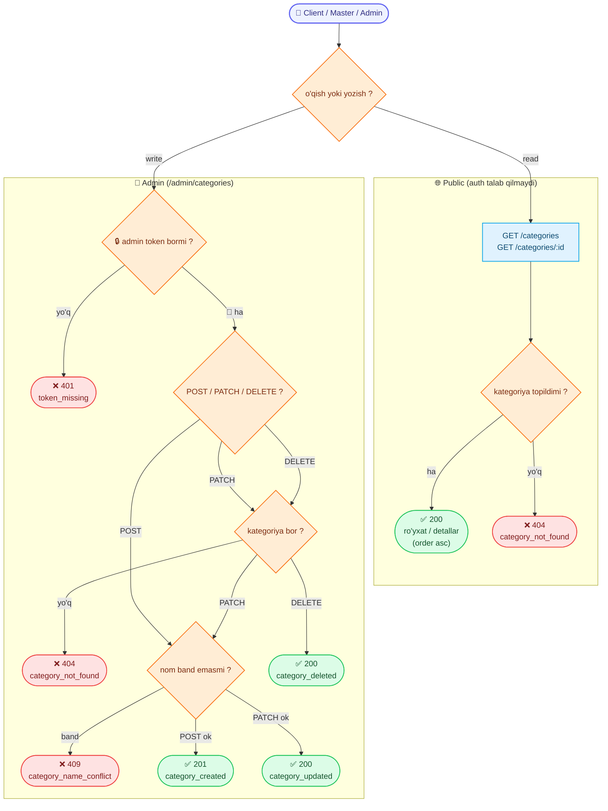

# Xizmat kategoriyalari (Categories)

Reference (ma'lumotnoma) ma'lumotlari — masterlar o'z xizmatlarini taklif qilishda, mijozlar va buyurtmalar esa tanlashda shu kategoriyalardan foydalanadi. O'qish **public**, CRUD esa **admin**ga tegishli.

Base URL: `https://api.fixleo.com/api/v1`

> **Til:** barcha `message` (va validatsiya `errors[].message`) `Accept-Language` (uz / ru / en) bo'yicha tarjimalanadi — misollarda inglizcha keltirilgan. Umumiy format/qoidalar: `Backend Config for client.md`.

Barcha javoblar standart konvertda:

```json
{ "success": true, "message": "...", "data": {} }
```

Xatolar:

```json
{ "success": false, "message": "...", "statusCode": 404, "path": "...", "timestamp": "...", "requestId": "..." }
```

> Har bir javobda `X-Request-Id` header bo'ladi; xato konvertidagi `requestId` shu bilan bir xil — log/qo'llab-quvvatlash uchun korrelyatsiya id'si.

`CategoryResponseDto` maydonlari:

| Maydon      | Turi   | Izoh                                          |
| ----------- | ------ | --------------------------------------------- |
| `id`        | number | Raqamli id (masalan `1`)                      |
| `name`      | string | Kategoriya nomi                               |
| `order`     | number | Saralash tartibi — o'sish bo'yicha (ascending) |
| `createdAt` | string | ISO sana                                      |
| `updatedAt` | string | ISO sana                                      |

> **Admin route'lari** (`/admin/categories`) admin token talab qiladi (qarang `AdminLogin.md`): `Authorization: Bearer <admin accessToken>`. `admin` va `superadmin` rollarining ikkalasi ham kira oladi.
>
> **Public route'lari** (`/categories`) auth talab qilmaydi.

---

## 🔄 Jarayon sxemasi (workflow)



---

## 1. Kategoriyalar ro'yxati (public)

`GET /categories`

Auth shart emas. Barcha kategoriyalar `order` bo'yicha (o'sish) qaytadi.

**Response `200`:**

```json
{
  "success": true,
  "message": "Categories list",
  "data": [
    {
      "id": 1,
      "name": "Сантехника",
      "order": 0,
      "createdAt": "2026-06-14T00:00:00.000Z",
      "updatedAt": "2026-06-14T00:00:00.000Z"
    },
    {
      "id": 2,
      "name": "Электрика",
      "order": 1,
      "createdAt": "2026-06-14T00:00:00.000Z",
      "updatedAt": "2026-06-14T00:00:00.000Z"
    }
  ]
}
```

> Ro'yxat odatda kichik (10–20 ta), shuning uchun **pagination yo'q** — to'liq massiv qaytadi.

---

## 2. Bitta kategoriyani ko'rish (public)

`GET /categories/:id`

Auth shart emas.

**Response `200`:**

```json
{
  "success": true,
  "message": "Category details",
  "data": {
    "id": 1,
    "name": "Сантехника",
    "order": 0,
    "createdAt": "2026-06-14T00:00:00.000Z",
    "updatedAt": "2026-06-14T00:00:00.000Z"
  }
}
```

**Xatolar:**

| Kod | Sabab                | Izoh                    |
| --- | -------------------- | ----------------------- |
| 404 | Kategoriya topilmadi | `Category #1 not found` |

---

## 3. Kategoriya yaratish (admin)

`POST /admin/categories`

Admin token talab qilinadi. `name` **unique** bo'lishi shart.

**Request:**

```json
{
  "name": "Сантехника",
  "order": 0
}
```

| Maydon  | Majburiy | Qoidalar                                       |
| ------- | -------- | ---------------------------------------------- |
| `name`  | ✅       | 2–100 belgi. Unique bo'lishi shart             |
| `order` | ❌       | Butun son, `≥ 0`. Berilmasa default `0`        |

**Response `201`:**

```json
{
  "success": true,
  "message": "Category created",
  "data": {
    "id": 3,
    "name": "Сантехника",
    "order": 0,
    "createdAt": "2026-06-14T00:00:00.000Z",
    "updatedAt": "2026-06-14T00:00:00.000Z"
  }
}
```

**Xatolar:**

| Kod | Sabab                                  | Izoh                                          |
| --- | -------------------------------------- | --------------------------------------------- |
| 400 | Validatsiya — `name` majburiy/qisqa    | validatsiya xabari                            |
| 401 | Admin token yo'q / noto'g'ri           | `Access token is missing`                     |
| 409 | Shu nomli kategoriya allaqachon mavjud | `A category named "Сантехника" already exists` |

---

## 4. Kategoriyani tahrirlash — qisman (admin)

`PATCH /admin/categories/:id`

Admin token talab qilinadi. Faqat **yuborilgan maydonlar** o'zgaradi.

**Request (masalan, faqat nom):**

```json
{ "name": "Электрика" }
```

| Maydon  | Qoidalar                            |
| ------- | ----------------------------------- |
| `name`  | 2–100 belgi. Unique bo'lishi shart  |
| `order` | Butun son, `≥ 0`                    |

**Response `200`:**

```json
{
  "success": true,
  "message": "Category updated",
  "data": {
    "id": 3,
    "name": "Электрика",
    "order": 0,
    "createdAt": "2026-06-14T00:00:00.000Z",
    "updatedAt": "2026-06-14T00:10:00.000Z"
  }
}
```

**Xatolar:**

| Kod | Sabab                          | Izoh                                         |
| --- | ------------------------------ | -------------------------------------------- |
| 400 | Validatsiya (`name`/`order`)   | validatsiya xabari                           |
| 401 | Admin token yo'q / noto'g'ri   | `Access token is missing`                    |
| 404 | Kategoriya topilmadi           | `Category #3 not found`                      |
| 409 | Shu nom allaqachon band        | `A category named "Электрика" already exists` |

---

## 5. Kategoriyani o'chirish (admin)

`DELETE /admin/categories/:id`

Admin token talab qilinadi.

**Response `200`:**

```json
{ "success": true, "message": "Category deleted", "data": null }
```

**Xatolar:**

| Kod | Sabab                          | Izoh                      |
| --- | ------------------------------ | ------------------------- |
| 401 | Admin token yo'q / noto'g'ri   | `Access token is missing` |
| 404 | Kategoriya topilmadi           | `Category #3 not found`   |

---

## Endpointlar xulosasi

| Method   | Route                    | Auth   | Vazifa             | Message           |
| -------- | ------------------------ | ------ | ------------------ | ----------------- |
| `GET`    | `/categories`            | public | Ro'yxat            | `Categories list` |
| `GET`    | `/categories/:id`        | public | Bitta kategoriya   | `Category details`|
| `POST`   | `/admin/categories`      | admin  | Yaratish (`201`)   | `Category created`|
| `PATCH`  | `/admin/categories/:id`  | admin  | Qisman tahrirlash  | `Category updated`|
| `DELETE` | `/admin/categories/:id`  | admin  | O'chirish          | `Category deleted`|

Swagger: `https://api.fixleo.com/api/docs` ("Categories" va "Admin: Categories" bo'limlari).
