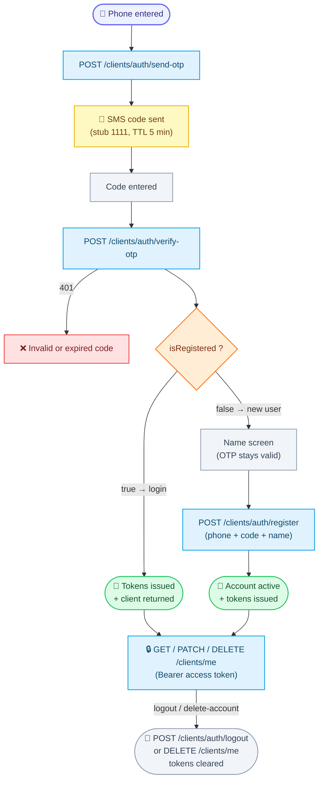

# Client: Login yoki Registratsiya (bitta flow)

Client app (mobile / frontend) uchun autentifikatsiya hujjati.

Accountga kirish uchun **faqat bitta flow** bor — telefon raqam + SMS OTP. User ro'yxatdan o'tgan bo'lsa login bo'ladi, o'tmagan bo'lsa ro'yxatdan o'tadi. Alohida "login" va "register" sahifalari kerak emas.

> **MUHIM (vaqtinchalik):** Real SMS provider hali ulanmagan. Hozircha OTP kod **doim `1111`**. Provider ulangach bu hujjat yangilanadi, flow o'zgarmaydi.

Base URL: `https://api.fixleo.com/api/v1`

> **Til:** barcha `message` (va validatsiya `errors[].message`) `Accept-Language` (uz / ru / en) bo'yicha tarjimalanadi — misollarda inglizcha keltirilgan. Javob/xato formati: `Backend Config for client.md`.

Barcha javoblar standart konvertda qaytadi:

```json
{ "success": true, "message": "...", "data": {} }
```

Xatolar:

```json
{
  "success": false,
  "message": "...",
  "statusCode": 400,
  "path": "...",
  "timestamp": "...",
  "requestId": "..."
}
```

> **Request ID:** har bir javobda `X-Request-Id` header bo'ladi (so'rovni kuzatish uchun), xato konvertida esa o'sha qiymat `requestId` maydonida qaytadi. Support'ga murojaat qilishda shu qiymatni yuboring.

> **Rate-limit (429):** sezgir auth endpointlari Redis-backed cheklovga ega — IP bo'yicha umumiy budjet (30 so'rov / daqiqa) va telefon bo'yicha OTP cheklovlari (pastda). Limit oshsa `429` + `Too many requests — try again in {seconds}s` (yoki OTP tekshirishda `Too many attempts — try again in {seconds}s`) qaytadi. `{seconds}` — qancha kutish kerakligi.

---

## 🔄 Jarayon sxemasi (workflow)



---

## 1. OTP yuborish

`POST /clients/auth/send-otp`

Birinchi marta murojaat qilingan raqam uchun client avtomatik yaratiladi (`status: unverified`).

**Request:**

```json
{ "phone": "+998901234567" }
```

- `phone` — xalqaro formatda, `+` bilan (dastur global): `+998901234567`, `+12025550123`, ...

**Response `200`:**

```json
{
  "success": true,
  "message": "OTP sent",
  "data": { "phone": "+998901234567", "expiresInSeconds": 300 }
}
```

Kod **5 daqiqa** amal qiladi va serverda **Redis**'da saqlanadi (key `otp:client:<phone>`, TTL 5 daqiqa) — bazada saqlanmaydi. Qayta so'ralsa yangi kod yoziladi (eskisi bekor).

**Cheklovlar (per telefon):** bitta raqamga **daqiqasiga 1 marta** va **soatiga 5 marta** OTP yuborish mumkin. Tezroq qayta so'ralsa `429 Too many requests — try again in {seconds}s` qaytadi — UI'da "qayta yuborish" tugmasini `{seconds}` soniya kutdiring.

**Xatolar:**

| Kod | Sabab                     | Message                                                     |
| --- | ------------------------- | ----------------------------------------------------------- |
| 400 | Telefon formati noto'g'ri | `Phone must be in international format, e.g. +998901234567` |
| 403 | Account bloklangan        | `Account is blocked: <sabab>`                               |
| 429 | OTP cheklovi oshdi (1/daq yoki 5/soat) | `Too many requests — try again in {seconds}s`  |

---

## 1a. OTP qayta yuborish

`POST /clients/auth/resend-otp`

`send-otp` ning aynan o'zi — yangi kod yuboradi va **xuddi shu per-telefon cooldown**'ga (1/daqiqa, 5/soat) bo'ysunadi. UI'dagi "Kodni qayta yuborish" tugmasi uchun qulay alias.

**Request / Response / Xatolar** — `send-otp` bilan bir xil (yuqoriga qarang).

---

## 2. OTP tekshirish

`POST /clients/auth/verify-otp`

**Request:**

```json
{ "phone": "+998901234567", "code": "1111" }
```

**Response `200` — user allaqachon ro'yxatdan o'tgan (LOGIN):**

```json
{
  "success": true,
  "message": "OTP verified",
  "data": {
    "isRegistered": true,
    "accessToken": "eyJhbGciOi...",
    "refreshToken": "eyJhbGciOi...",
    "client": {
      "id": "#U-00000000001",
      "phone": "+998901234567",
      "name": "Hojiakbar Murodillayev",
      "status": "active",
      "blockReason": null,
      "createdAt": "2026-06-08T10:00:00.000Z",
      "updatedAt": "2026-06-08T10:00:00.000Z"
    }
  }
}
```

➡️ Tokenlarni saqlang, user profilga kirdi. Flow tugadi.

**Response `200` — user YANGI (ism so'raladi):**

```json
{
  "success": true,
  "message": "OTP verified",
  "data": { "isRegistered": false }
}
```

➡️ Ism kiritish ekranini ko'rsating va 3-qadamga o'ting. Kod hali amal qiladi — qayta SMS so'rash shart emas.

> **Lockout:** ketma-ket **5 marta** noto'g'ri kod kiritilsa, o'sha telefon **15 daqiqaga** bloklanadi — keyingi urinishlar `429 Too many attempts — try again in {seconds}s` qaytaradi. To'g'ri kod kiritilsa hisoblagich nolga tushadi.

**Xatolar:**

| Kod | Sabab                                                   | Message                       |
| --- | ------------------------------------------------------- | ----------------------------- |
| 401 | Kod noto'g'ri / muddati o'tgan / send-otp chaqirilmagan | `Invalid or expired code`     |
| 403 | Account bloklangan                                      | `Account is blocked: <sabab>` |
| 429 | 5 marta noto'g'ri kod → 15 daqiqa lock                  | `Too many attempts — try again in {seconds}s` |

---

## 3. Registratsiyani yakunlash (faqat yangi userlar)

`POST /clients/auth/register`

O'sha telefon + o'sha kod + ism yuboriladi.

**Request:**

```json
{
  "phone": "+998901234567",
  "code": "1111",
  "name": "Hojiakbar Murodillayev"
}
```

- `name` — kamida 3, ko'pi 100 belgi.

**Response `201`:**

```json
{
  "success": true,
  "message": "Registration completed",
  "data": {
    "accessToken": "eyJhbGciOi...",
    "refreshToken": "eyJhbGciOi...",
    "client": {
      "id": "#U-00000000001",
      "phone": "+998901234567",
      "name": "Hojiakbar Murodillayev",
      "status": "active",
      "blockReason": null,
      "createdAt": "2026-06-08T10:00:00.000Z",
      "updatedAt": "2026-06-08T10:05:00.000Z"
    }
  }
}
```

➡️ Account yaratildi (`status: active`), tokenlar berildi. Flow tugadi.

---

## Tokenlardan foydalanish

Himoyalangan endpointlarga so'rovda header qo'shing:

```
Authorization: Bearer <accessToken>
```

| Token          | Muddati   | Vazifasi                                |
| -------------- | --------- | --------------------------------------- |
| `accessToken`  | 15 daqiqa | Har bir so'rovda yuboriladi             |
| `refreshToken` | 7 kun     | Access token eskirganda yangilash uchun |

### Token yangilash

`POST /clients/auth/refresh`

```json
{ "refreshToken": "eyJhbGciOi..." }
```

**Response `200`:** yangi `accessToken` + `refreshToken` juftligi.

`401` kelsa — refresh ham eskirgan **yoki bekor qilingan** (logout qilingan), userni flow boshiga qaytaring (telefon kiritish).

### Chiqish (logout)

`POST /clients/auth/logout`

Refresh tokenni **bekor qiladi** (Redis blacklist) — undan keyin o'sha token bilan `/refresh` qilib bo'lmaydi (`401`). Idempotent: allaqachon eskirgan/yaroqsiz token yuborilsa ham `200` qaytadi.

**Request:**

```json
{ "refreshToken": "eyJhbGciOi..." }
```

**Response `200`:**

```json
{ "success": true, "message": "Logged out", "data": null }
```

➡️ Klientda saqlangan access va refresh tokenlarni o'chiring va userni flow boshiga qaytaring.

### Profil

`GET /clients/me` (Bearer token bilan)

**Response `200`:** yuqoridagi `client` obyekti.

### Profilni tahrirlash

`PATCH /clients/me` (Bearer token bilan)

Foydalanuvchi **faqat o'z ismini** o'zgartira oladi. **Telefon raqam o'zgarmaydi.**

**Request:**

```json
{ "name": "Hojiakbar M." }
```

- `name` — kamida 3, ko'pi 100 belgi.

**Response `200`:** yangilangan `client` obyekti.

**Xatolar:**

| Kod | Sabab | Message |
| --- | ----- | ------- |
| 400 | Ism 3 belgidan qisqa | validatsiya xabari |
| 401 | Token yo'q / eskirgan | `Invalid or expired access token` |
| 403 | Account bloklangan | `Account is blocked: <sabab>` |

### Account'ni o'chirish (self-delete)

`DELETE /clients/me` (Bearer token bilan)

Foydalanuvchi o'z account'ini o'zi o'chiradi. Bu **soft-delete** — yozuv bazada qoladi (`deleted_at` belgilanadi, status `blocked` bo'ladi), lekin **telefon raqam bo'shatiladi**, ya'ni o'sha raqam bilan qaytadan ro'yxatdan o'tish mumkin.

**Request:** body yo'q.

**Response `200`:**

```json
{ "success": true, "message": "Account deleted", "data": null }
```

➡️ Klientda saqlangan tokenlarni o'chiring. O'chirilgandan keyin amaldagi tokenlar bilan ham profil endpointlari `403` (account bloklangan) qaytaradi.

**Xatolar:**

| Kod | Sabab | Message |
| --- | ----- | ------- |
| 401 | Token yo'q / eskirgan | `Invalid or expired access token` |

---

## Client statuslari

| Status       | Ma'nosi                                                                    |
| ------------ | -------------------------------------------------------------------------- |
| `unverified` | Telefon hali tasdiqlanmagan (faqat send-otp qilingan)                      |
| `active`     | To'liq ro'yxatdan o'tgan, faol                                             |
| `blocked`    | Bloklangan — `blockReason` da sababi. **Har bir client API** (auth flow va himoyalangan endpointlar) `403 Account is blocked: <sabab>` qaytaradi — amaldagi token bilan ham |

## ID formati

Client ID raqamlari ketma-ket bo'lib, API'da `#U-00000000001` ko'rinishida qaytadi (11 xonagacha nol bilan to'ldiriladi).

## Frontend uchun eslatmalar

- Telefonni yuborishdan oldin bo'shliq/defislarni olib tashlang (backend ham tozalaydi, lekin baribir).
- `verify-otp` dagi `isRegistered` flag'iga qarab navigatsiya qiling: `true` → asosiy ekran, `false` → ism ekrani.
- 401 `Invalid or expired code` — userga "Kod noto'g'ri yoki eskirgan" ko'rsating, qayta yuborish tugmasi `send-otp` (yoki alias `resend-otp`) ni chaqiradi.
- 429 kelganda (`Too many requests` / `Too many attempts`) — UI'da retry tugmasini xabardagi `{seconds}` soniya kutdiring.
- Logout/delete'dan keyin saqlangan access **va** refresh tokenlarni o'chiring; logout qilingan refresh token bilan `/refresh` endi `401` qaytaradi.
- Har bir javobdagi `X-Request-Id` headerini loglarda saqlang — bug report'da support'ga shu qiymatni bering.
- Swagger: `https://api.fixleo.com/api/docs` ("Clients" bo'limi).
