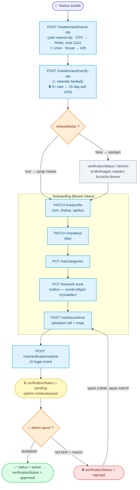

# Master: ro'yxatdan o'tish (onboarding + KYC)

Usta (master) ilovasi uchun autentifikatsiya va onboarding hujjati.

Kirish **telefon raqam + SMS OTP** orqali (OTP Redis'da). `verify-otp` birinchi kontaktda master yaratadi (`status: unverified`) va **darhol token** beradi — ko'p bosqichli onboarding shu token bilan davom etadi.

> **MUHIM (vaqtinchalik):** Real SMS provider hali ulanmagan. Hozircha OTP kod **doim `1111`**. Provider ulangach bu hujjat yangilanadi, flow o'zgarmaydi.

Base URL: `https://api.fixleo.com/api/v1`

> **Til:** barcha `message` (va validatsiya `errors[].message`) `Accept-Language` (uz / ru / en) bo'yicha tarjimalanadi — misollarda inglizcha keltirilgan. Umumiy format/qoidalar: `Backend Config for client.md`.

Barcha javoblar standart konvertda qaytadi:

```json
{ "success": true, "message": "...", "data": {} }
```

Xatolar:

```json
{ "success": false, "message": "...", "statusCode": 400, "path": "...", "timestamp": "..." }
```

---

## 🔄 Jarayon sxemasi (workflow)



---

## Status oqimi

```
unverified
   │  (7–10: onboarding — profil, bio, kategoriya, ish zonasi)
   │  (11–12: KYC hujjatlarini yuklash)
   ▼
POST /masters/me/verification/submit
   │
   ▼
verificationStatus: pending   ← admin moderatsiyasini kutadi
   │
   ├── admin tasdiqlasa  ──► status: active   + verificationStatus: approved ✅
   │
   └── admin rad etsa    ──► verificationStatus: rejected
                                   │ (hujjatni qayta yuklab, qayta submit)
                                   ▼
                              verificationStatus: pending
```

`MasterResponseDto` maydonlari:

| Maydon               | Turi                                                        | Izoh                                                    |
| -------------------- | ----------------------------------------------------------- | ------------------------------------------------------- |
| `id`                 | string                                                      | Public ketma-ket ID, masalan `#M-00000000001`           |
| `phone`              | string                                                      | Xalqaro format                                          |
| `name`               | string \| null                                              | Onboarding to'ldirilmaguncha `null`                     |
| `city`               | string \| null                                              |                                                         |
| `experienceYears`    | number \| null                                              | Tajriba (yil)                                           |
| `bio`                | string \| null                                              | "O'zim haqimda"                                         |
| `avatarUrl`          | string \| null                                              |                                                         |
| `status`             | `unverified` \| `active` \| `blocked`                       |                                                         |
| `verificationStatus` | `not_submitted` \| `pending` \| `approved` \| `rejected`    |                                                         |
| `latitude`           | number \| null                                              |                                                         |
| `longitude`          | number \| null                                              |                                                         |
| `workRadiusKm`       | number \| null                                              | Qamrov radiusi (km)                                     |
| `categories`         | `[{ id, name }]`                                            | Tanlangan xizmat kategoriyalari                         |
| `createdAt`          | string (ISO)                                                |                                                         |
| `updatedAt`          | string (ISO)                                                |                                                         |

`DocumentDto` maydonlari:

| Maydon      | Turi                                                       | Izoh                                            |
| ----------- | ---------------------------------------------------------- | ----------------------------------------------- |
| `id`        | number                                                     |                                                 |
| `type`      | `oneid` \| `passport_front` \| `passport_back` \| `selfie_with_passport` |                                              |
| `mimeType`  | string                                                     | `image/jpeg`, `image/png`, `image/webp`         |
| `sizeBytes` | number                                                     | Fayl hajmi (bayt)                               |
| `url`       | string                                                     | Qisqa muddatli presigned yuklab olish havolasi (≈5 daqiqa) |
| `createdAt` | string (ISO)                                               |                                                 |
| `updatedAt` | string (ISO)                                               |                                                 |

---

## 1. OTP yuborish

`POST /masters/auth/send-otp`

Birinchi marta murojaat qilingan raqam uchun hali hech narsa yaratilmaydi — kod faqat Redis'ga yoziladi.

**Request:**

```json
{ "phone": "+998901234599" }
```

- `phone` — xalqaro formatda, `+` bilan: `+998901234599`.

**Response `200`:**

```json
{
  "success": true,
  "message": "OTP sent",
  "data": { "phone": "+998901234599", "expiresInSeconds": 300 }
}
```

Kod **5 daqiqa** amal qiladi. Qayta so'ralsa — yangi kod yuboriladi (eskisi bekor).

> **Tezlik cheklovi (anti-spam, Redis):** bitta telefon uchun **1 daqiqada 1 marta** va **1 soatda 5 marta** OTP yuborish mumkin. Cheklov oshsa `429 too_many_requests` qaytadi (`Too many requests — try again in {seconds}s`) — `{seconds}` keyingi urinishgacha qolgan vaqt. Front "Qayta yuborish" tugmasini shu sekundlar tugaguncha bloklab tursin.

**Xatolar:**

| Kod | Sabab                              | Izoh                                                        |
| --- | ---------------------------------- | ----------------------------------------------------------- |
| 400 | Telefon formati noto'g'ri          | `Phone must be in international format, e.g. +998901234567` |
| 403 | Account bloklangan                 | `Account is blocked: <sabab>`                               |
| 429 | Juda tez-tez yuborildi (cooldown / soatlik limit) | `Too many requests — try again in {seconds}s`  |

---

## 2. OTP qayta yuborish

`POST /masters/auth/resend-otp`

`send-otp` ning aliasi — yangi kod yuboradi (eskisi bekor) va **xuddi shu tezlik cheklovi** (1/min + 5/soat) amal qiladi. Foydalanuvchi kodni olmagan / yo'qotgan holatlar uchun.

**Request:**

```json
{ "phone": "+998901234599" }
```

**Response `200`:** `send-otp` bilan bir xil.

```json
{
  "success": true,
  "message": "OTP sent",
  "data": { "phone": "+998901234599", "expiresInSeconds": 300 }
}
```

**Xatolar:** `send-otp` bilan bir xil (400 / 403 / 429).

---

## 3. OTP tekshirish (login / yaratish)

`POST /masters/auth/verify-otp`

Birinchi kontaktda master yaratiladi (`status: unverified`, `verificationStatus: not_submitted`). Har holatda token juftligi qaytadi — javobdagi `isNewMaster` va `master` obyektiga qarab onboardingni qaysi qadamdan davom ettirishni aniqlang.

**Request:**

```json
{ "phone": "+998901234599", "code": "1111" }
```

`isNewMaster` — bu so'rov masterni **yangi yaratganmi** (birinchi login = ro'yxatdan o'tish):

- `isNewMaster: true` → yangi master, onboardingni boshidan (profil qadami) boshlang.
- `isNewMaster: false` → qaytgan master; `master.verificationStatus` (`approved` / `pending` / `rejected`) yoki birinchi to'ldirilmagan onboarding maydoni bo'yicha tegishli qadamga yo'naltiring.

**Response `200` — yangi master (`isNewMaster: true`):**

```json
{
  "success": true,
  "message": "OTP verified",
  "data": {
    "accessToken": "eyJhbGciOi...",
    "refreshToken": "eyJhbGciOi...",
    "isNewMaster": true,
    "master": {
      "id": "#M-00000000001",
      "phone": "+998901234599",
      "name": null,
      "city": null,
      "experienceYears": null,
      "bio": null,
      "avatarUrl": null,
      "status": "unverified",
      "verificationStatus": "not_submitted",
      "latitude": null,
      "longitude": null,
      "workRadiusKm": null,
      "categories": [],
      "createdAt": "2026-06-14T10:00:00.000Z",
      "updatedAt": "2026-06-14T10:00:00.000Z"
    }
  }
}
```

➡️ Tokenlarni saqlang va onboardingni boshlang.

> **Brute-force himoyasi (Redis):** ketma-ket **5 ta noto'g'ri kod** kiritilsa telefon **15 daqiqaga** bloklanadi — bu davrda har bir urinish `429 account_locked` (`Too many attempts — try again in {seconds}s`) qaytaradi (`{seconds}` — qulf ochilguncha qolgan vaqt). To'g'ri kod kiritilishi bilan hisoblagich tozalanadi.

**Xatolar:**

| Kod | Sabab                                                   | Izoh                                    |
| --- | ------------------------------------------------------- | --------------------------------------- |
| 401 | Kod noto'g'ri / muddati o'tgan / send-otp chaqirilmagan | `Invalid or expired code`               |
| 403 | Account bloklangan                                      | `Account is blocked: <sabab>`           |
| 429 | 5 marta noto'g'ri kod → telefon 15 daqiqaga qulflandi   | `Too many attempts — try again in {seconds}s` |

---

## 4. Token yangilash

`POST /masters/auth/refresh`

**Request:**

```json
{ "refreshToken": "eyJhbGciOi..." }
```

**Response `200`:**

```json
{
  "success": true,
  "message": "Tokens refreshed",
  "data": {
    "accessToken": "eyJhbGciOi...",
    "refreshToken": "eyJhbGciOi..."
  }
}
```

`401` kelsa — refresh ham eskirgan (yoki `logout` bilan bekor qilingan), masterni flow boshiga qaytaring (telefon kiritish).

> Refresh tokenlar **bekor qilinadi**: `logout` chaqirilgan refresh token Redis qora ro'yxatiga tushadi va keyingi `refresh` urinishida `401` beradi.

**Xatolar:**

| Kod | Sabab                          | Izoh                                |
| --- | ------------------------------ | ----------------------------------- |
| 401 | Refresh token yaroqsiz/eskirgan | `Invalid or expired refresh token` |

---

## 5. Logout (refresh tokenni bekor qilish)

`POST /masters/auth/logout`

Joriy refresh tokenni bekor qiladi — undan keyin u bilan `refresh` qilib bo'lmaydi (Redis qora ro'yxati). **Idempotent**: allaqachon yaroqsiz/eskirgan token yuborilsa ham `200` qaytadi. Front bu chaqiruvdan keyin saqlangan access va refresh tokenlarni o'chirib tashlasin.

**Request:**

```json
{ "refreshToken": "eyJhbGciOi..." }
```

**Response `200`:**

```json
{ "success": true, "message": "Logged out", "data": null }
```

---

> **Quyidagi barcha endpointlar (6–13) master token talab qiladi:**
>
> ```
> Authorization: Bearer <master accessToken>
> ```
>
> Token yo'q / eskirgan bo'lsa `401 Invalid or expired access token`, bloklangan master bo'lsa `403 Account is blocked: <sabab>` qaytadi. Quyidagi xato jadvallarida bu ikki holat takrorlanmaydi.

---

## 6. Joriy master profili

`GET /masters/me`

**Response `200`:**

```json
{
  "success": true,
  "message": "Master profile",
  "data": {
    "id": "#M-00000000001",
    "phone": "+998901234599",
    "name": "Alexey Ivanov",
    "city": "Tashkent",
    "experienceYears": 5,
    "bio": "Tajribali santexnik, ozoda ishlayman.",
    "avatarUrl": null,
    "status": "unverified",
    "verificationStatus": "not_submitted",
    "latitude": 41.311081,
    "longitude": 69.240562,
    "workRadiusKm": 5,
    "categories": [{ "id": 1, "name": "Santexnika" }],
    "createdAt": "2026-06-14T10:00:00.000Z",
    "updatedAt": "2026-06-14T10:20:00.000Z"
  }
}
```

---

## 7. Onboarding — profil (ism, shahar, tajriba)

`PATCH /masters/me/profile`

Qisman (PATCH) — faqat yuborilgan maydonlar yangilanadi.

**Request:**

```json
{ "name": "Alexey Ivanov", "city": "Tashkent", "experienceYears": 5 }
```

| Maydon            | Qoidalar                          |
| ----------------- | --------------------------------- |
| `name?`           | 3–100 belgi                       |
| `city?`           | 2–100 belgi                       |
| `experienceYears?`| butun son, `0`–`80`               |

**Response `200`:** yangilangan `MasterResponseDto`, `message: "Profile updated"`.

**Xatolar:**

| Kod | Sabab                          | Izoh                |
| --- | ------------------------------ | ------------------- |
| 400 | Maydon qoidalarga mos emas     | validatsiya xabari  |

---

## 8. Onboarding — o'zim haqimda (bio)

`PATCH /masters/me/about`

**Request:**

```json
{ "bio": "Tajribali santexnik. Ozoda ishlayman, o'z asbobim bor." }
```

| Maydon | Qoidalar           |
| ------ | ------------------ |
| `bio?` | maksimum 1000 belgi |

**Response `200`:** yangilangan `MasterResponseDto`, `message: "Profile updated"`.

**Xatolar:**

| Kod | Sabab                      | Izoh               |
| --- | -------------------------- | ------------------ |
| 400 | `bio` 1000 belgidan uzun   | validatsiya xabari |

---

## 9. Onboarding — xizmat kategoriyalari

`PUT /masters/me/categories`

To'liq to'plam yuboriladi — oldingi tanlovni **butunlay almashtiradi**.

**Request:**

```json
{ "categoryIds": [1, 2] }
```

| Maydon        | Qoidalar                                          |
| ------------- | ------------------------------------------------- |
| `categoryIds` | butun sonlar massivi (har biri ≥ 1), maksimum 50 ta |

**Response `200`:** yangilangan `MasterResponseDto` (yangi `categories` bilan), `message: "Categories updated"`.

**Xatolar:**

| Kod | Sabab                                  | Izoh                                    |
| --- | -------------------------------------- | --------------------------------------- |
| 400 | Massiv noto'g'ri                       | validatsiya xabari                      |
| 404 | Berilgan ID(lar)dan biri mavjud emas   | `One or more categories do not exist`   |

---

## 10. Onboarding — ish zonasi

`PUT /masters/me/work-zone`

Bazaviy joylashuv (lat/lng) va qamrov radiusini o'rnatadi.

**Request:**

```json
{ "latitude": 41.311081, "longitude": 69.240562, "workRadiusKm": 5 }
```

| Maydon         | Qoidalar                                                              |
| -------------- | -------------------------------------------------------------------- |
| `latitude`     | son, `-90`–`90`                                                       |
| `longitude`    | son, `-180`–`180`                                                     |
| `workRadiusKm` | butun son — **`GET /work-radiuses` ro'yxatidagi qiymatlardan biri** bo'lishi shart (qarang `WorkRadius.md`) |

> Radius qat'iy ro'yxat bilan cheklangan. Front "Ish zonasi" ekranida variantlarni `GET /work-radiuses` dan oladi (default: 3 / 5 / 10 km), shu sababli foydalanuvchi faqat ruxsat etilgan qiymatni yuboradi.

**Response `200`:** yangilangan `MasterResponseDto`, `message: "Work zone updated"`.

**Xatolar:**

| Kod | Sabab                                    | Izoh                              |
| --- | ---------------------------------------- | --------------------------------- |
| 400 | Koordinata diapazondan tashqari          | validatsiya xabari                |
| 400 | Radius ruxsat etilgan ro'yxatda yo'q     | `Work radius 7 km is not allowed` |

---

## 11. KYC hujjatini yuklash

`POST /masters/me/documents`

**Content-Type:** `multipart/form-data`

O'sha turdagi hujjatni qayta yuklash — eskisini **almashtiradi**.

**Form maydonlari:**

| Maydon | Turi   | Qoidalar                                                                |
| ------ | ------ | ---------------------------------------------------------------------- |
| `type` | string | `oneid` \| `passport_front` \| `passport_back` \| `selfie_with_passport` |
| `file` | binary | JPEG / PNG / WebP, maksimum **10MB**                                    |

**Response `201`:**

```json
{
  "success": true,
  "message": "Document uploaded",
  "data": {
    "id": 1,
    "type": "passport_front",
    "mimeType": "image/jpeg",
    "sizeBytes": 245678,
    "url": "https://api.fixleo.com/storage/fixleo/masters/1/passport_front-...jpg?X-Amz-...",
    "createdAt": "2026-06-14T10:25:00.000Z",
    "updatedAt": "2026-06-14T10:25:00.000Z"
  }
}
```

**Xatolar:**

| Kod | Sabab                       | Izoh                                          |
| --- | --------------------------- | --------------------------------------------- |
| 400 | Fayl yuborilmagan           | `A file is required`                          |
| 400 | Ruxsat etilmagan fayl turi  | `Only JPEG, PNG or WebP images are allowed`   |
| 400 | Fayl juda katta             | `File is too large (max 10MB)`                |
| 400 | `type` noto'g'ri            | validatsiya xabari                            |

---

## 12. KYC hujjatlari ro'yxati

`GET /masters/me/documents`

Yuklangan hujjatlar (har birida yangi presigned `url`).

**Response `200`:**

```json
{
  "success": true,
  "message": "Documents",
  "data": [
    {
      "id": 1,
      "type": "passport_front",
      "mimeType": "image/jpeg",
      "sizeBytes": 245678,
      "url": "https://api.fixleo.com/storage/fixleo/masters/1/passport_front-...jpg?X-Amz-...",
      "createdAt": "2026-06-14T10:25:00.000Z",
      "updatedAt": "2026-06-14T10:25:00.000Z"
    },
    {
      "id": 2,
      "type": "passport_back",
      "mimeType": "image/png",
      "sizeBytes": 198342,
      "url": "https://api.fixleo.com/storage/fixleo/masters/1/passport_back-...png?X-Amz-...",
      "createdAt": "2026-06-14T10:26:00.000Z",
      "updatedAt": "2026-06-14T10:26:00.000Z"
    }
  ]
}
```

> `url` qisqa muddatli (≈5 daqiqa). Eskirsa — ro'yxatni qayta so'rang.

---

## 13. Tekshiruvga yuborish

`POST /masters/me/verification/submit`

Yuborishdan oldin **3 ta hujjat** yuklangan bo'lishi shart: passport (old + orqa) va passport bilan selfie. Muvaffaqiyatda `verificationStatus` `pending` ga o'tadi va admin moderatsiyasini kutadi.

**Request:** body yo'q.

**Response `200`:**

```json
{
  "success": true,
  "message": "Submitted for verification",
  "data": {
    "id": "#M-00000000001",
    "phone": "+998901234599",
    "name": "Alexey Ivanov",
    "city": "Tashkent",
    "experienceYears": 5,
    "bio": "Tajribali santexnik, ozoda ishlayman.",
    "avatarUrl": null,
    "status": "unverified",
    "verificationStatus": "pending",
    "latitude": 41.311081,
    "longitude": 69.240562,
    "workRadiusKm": 5,
    "categories": [{ "id": 1, "name": "Santexnika" }],
    "createdAt": "2026-06-14T10:00:00.000Z",
    "updatedAt": "2026-06-14T10:30:00.000Z"
  }
}
```

➡️ Admin tasdiqlasa `status` → `active`, `verificationStatus` → `approved`. Rad etsa `verificationStatus` → `rejected` — hujjatni qayta yuklab (11-qadam), qayta submit qilish mumkin.

**Xatolar:**

| Kod | Sabab                                          | Izoh                                                  |
| --- | ---------------------------------------------- | ----------------------------------------------------- |
| 400 | Talab qilingan hujjatlar to'liq yuklanmagan    | `Upload all required documents first`                 |
| 400 | Allaqachon `pending` yoki `approved` holatda    | `Verification is already in progress or approved`     |

---

Swagger: `https://api.fixleo.com/api/docs` ("Masters" bo'limi).
