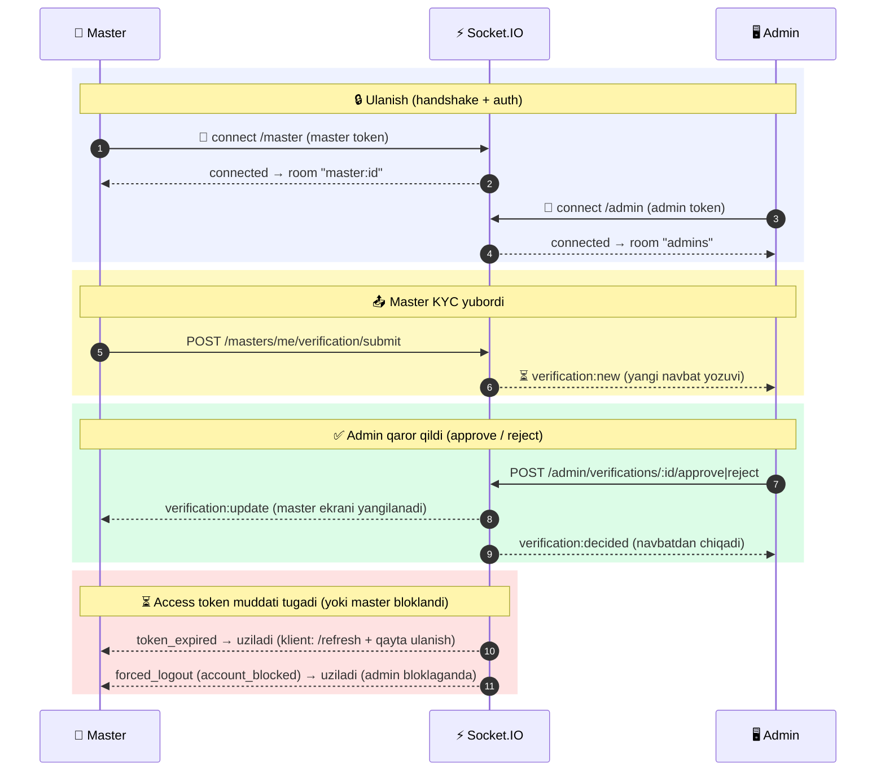

# Realtime (WebSocket) — verifikatsiya

Ikki tomonlama realtime (**Socket.IO**), polling o'rniga:

- **Master** (`/master` namespace): KYC yuborgach `pending` holatda kutadi, admin **tasdiqladi / rad etdi** zahoti natijani oladi — ekran o'zi yangilanadi.
- **Admin** (`/admin` namespace): master KYC **yuborgan** zahoti moderatsiya navbatiga yangi yozuv **jonli** keladi (`verification:new`); har qanday admin qaror qilsa navbat yangilanadi (`verification:decided`).

Transport: **Socket.IO** (WebSocket, kerak bo'lsa long-polling'ga tushadi). CORS HTTP bilan bir xil allowlist (`CORS_ORIGINS`) — qarang `Backend Config for client.md`.

Base (Socket.IO server): REST base'dan `/api` ni olib tashlang.

```
REST:    https://api.fixleo.com/api/v1
Socket:  https://api.fixleo.com        (namespace: /master  yoki  /admin)
```

> Har bir namespace o'z roli tokenini talab qiladi: `/master` → master token, `/admin` → admin token. Boshqa kind / yo'q / eskirgan token → ulanish rad etiladi (`unauthorized` + disconnect).

---

## 🔄 Jarayon sxemasi (workflow)



---

## 1. Ulanish (handshake + auth)

Master `accessToken`ini handshake'da yuboring — `auth.token` (afzal) yoki `Authorization` header:

```js
import { io } from 'socket.io-client';

const socket = io('https://api.fixleo.com/master', {
  auth: { token: masterAccessToken },           // afzal usul
  // yoki: extraHeaders: { Authorization: `Bearer ${masterAccessToken}` }
  transports: ['websocket', 'polling'],
});
```

Server tomonida har bir ulanish: token tekshiriladi (**access** turi, **master** kind), bazadan master qayta o'qiladi (bloklangan → rad), so'ng `master:<id>` room'ga qo'shiladi.

**Server → klient hodisalar:**

| Hodisa                | Qachon                                   | Payload                                      |
| --------------------- | ---------------------------------------- | -------------------------------------------- |
| `connected`           | Auth muvaffaqiyatli, room'ga qo'shildi   | `{ masterId: "#M-00000000001" }`             |
| `unauthorized`        | Token yo'q / noto'g'ri / boshqa kind     | `{ message: "Invalid or missing master token" }` (keyin disconnect) |
| `verification:update` | Admin tasdiqladi yoki rad etdi           | quyidagi jadval                              |
| `token_expired`       | Jonli soketdagi access token muddati tugadi | `{ message: "Access token expired — reconnect with a fresh token" }` (keyin disconnect) |
| `forced_logout`       | Admin masterni bloklab qo'ydi (soket majburan uziladi) | `{ reason: "account_blocked" }` (keyin disconnect) |

---

## 2. `verification:update` payload

```json
{
  "verificationStatus": "approved",
  "accountStatus": "active",
  "rejectionReason": null,
  "decidedAt": "2026-06-16T03:00:00.000Z"
}
```

| Maydon               | Turi                                  | Izoh                                                    |
| -------------------- | ------------------------------------- | ------------------------------------------------------- |
| `verificationStatus` | `approved` \| `rejected`              | Admin qarori                                            |
| `accountStatus`      | `unverified` \| `active` \| `blocked` | Hisob holati (tasdiqlanganda → `active`; rad etilganda o'zgarmaydi) |
| `rejectionReason`    | string \| null                        | Rad etilganda sabab; tasdiqlanganda `null`              |
| `decidedAt`          | string (ISO)                          | Qaror vaqti                                             |

**Klient mantig'i:** `approved` → "tasdiqlandi" ekrani; `rejected` → sabab ko'rsatiladi + "Hujjatlarni qayta yuklash".

---

## Token muddati va qayta ulanish

Soket sessiyasi **access token** muddatiga bog'langan — token cheksiz ochiq soketni "ushlab" qola olmaydi. Token `exp` vaqtiga yetganda server `token_expired` hodisasini yuboradi va soketni uzadi (ikkala namespace — `/master` va `/admin` — uchun ham bir xil).

Klient `token_expired` ni eshitgach:

1. `POST /api/v1/.../auth/refresh` (yoki tegishli refresh endpoint) orqali **yangi access token** oladi.
2. Yangi token bilan namespace'ga **qaytadan ulanadi** (`auth.token`ni yangilab).

```js
socket.on('token_expired', async () => {
  const fresh = await refreshAccessToken();          // POST .../auth/refresh
  socket.auth = { token: fresh };
  socket.connect();                                  // yangi token bilan qayta ulanish
});
```

> Eslatma: refresh token **bekor qilingan** bo'lsa (logout qilingan) `/refresh` → `401` qaytaradi — bunda foydalanuvchini qayta login qildiring, qayta ulanmang.

`/master` namespace'da yana bitta majburiy uzilish bor: admin masterni **bloklaganda** server o'sha master'ning jonli soketiga `forced_logout` (`{ reason: "account_blocked" }`) yuboradi va darhol uzadi. Bu hodisa kelganda token yangilash **shart emas** — foydalanuvchini login/"bloklangan" ekraniga chiqaring, qayta ulanishga urinmang.

---

## 3. Admin namespace (`/admin`)

Admin paneli **admin token** bilan `/admin` namespace'ga ulanadi va umumiy `admins` room'ga qo'shiladi — moderatsiya navbati shunda jonli yangilanadi.

```js
const socket = io('https://api.fixleo.com/admin', {
  auth: { token: adminAccessToken },
  transports: ['websocket', 'polling'],
});
socket.on('verification:new', () => reloadQueue());       // yangi yozuv keldi
socket.on('verification:decided', () => reloadQueue());    // yozuv hal qilindi
```

**Server → admin hodisalar:**

| Hodisa                 | Qachon                                   | Payload                                                              |
| ---------------------- | ---------------------------------------- | ------------------------------------------------------------------- |
| `connected`            | Auth muvaffaqiyatli, `admins` room       | `{ room: "admins" }`                                                |
| `unauthorized`         | Token yo'q / noto'g'ri / admin emas      | `{ message: "Invalid or missing admin token" }` (keyin disconnect)  |
| `verification:new`     | Master KYC yubordi (yangi pending yozuv) | `{ verificationId, submittedAt, master: { id, name, phone, city } }` |
| `verification:decided` | Verifikatsiya tasdiqlandi / rad etildi   | `{ verificationId, masterId, verificationStatus }`                  |
| `token_expired`        | Jonli soketdagi access token muddati tugadi | `{ message: "Access token expired — reconnect with a fresh token" }` (keyin disconnect) |

> Tavsiya: hodisa kelganda navbatni qayta yuklang (`GET /admin/verifications?status=pending`) — eng sodda va izchil yo'l. Payload'ni darhol ko'rsatish (toast/preview) uchun ham ishlatsa bo'ladi.

---

## 4. Fallback (WS bo'lmasa ham ishlaydi)

WS — **qulaylik**, yagona kanal emas. Hodisa o'tkazib yuborilsa ham holat yo'qolmaydi:

- **Qayta kirishda** `verify-otp` master holatini qaytaradi (`verificationStatus`) — ilova to'g'ri ekranni ochadi (qarang `MasterRegister.md`, `isNewMaster` / resume).
- **Qo'lda yangilash**: `GET /masters/me` ("Обновить статус" tugmasi) joriy holatni o'qiydi.

Shu sababli WS ulanmasa yoki uzilsa — master qayta kirib yoki yangilab holatni baribir ko'radi.

---

## Xulosa

| Namespace | Hodisa                 | Yo'nalish       | Vazifa                                       |
| --------- | ---------------------- | --------------- | -------------------------------------------- |
| `/master` | `verification:update`  | Server → master | Admin qarorini master'ga realtime yetkazish  |
| `/admin`  | `verification:new`     | Server → adminlar | Yangi KYC navbatga jonli qo'shiladi        |
| `/admin`  | `verification:decided` | Server → adminlar | Navbat yozuvi hal bo'ldi (ro'yxatdan chiqadi) |
| `/master` + `/admin` | `token_expired` | Server → klient | Access token muddati tugadi → klient `/refresh` qilib qayta ulanadi |
| `/master` | `forced_logout`        | Server → master | Admin masterni bloklaganda jonli soket majburan uziladi (`account_blocked`) |

Trigger'lar: master `POST /masters/me/verification/submit` → `verification:new`; admin `POST /admin/verifications/:id/approve|reject` → `verification:update` (master) + `verification:decided` (adminlar).

Ko'p instansli ishlash: emit Redis adapter orqali barcha instanslarga tarqaladi — qabul qiluvchi qaysi node'ga ulangan bo'lsa ham xabar yetadi.
