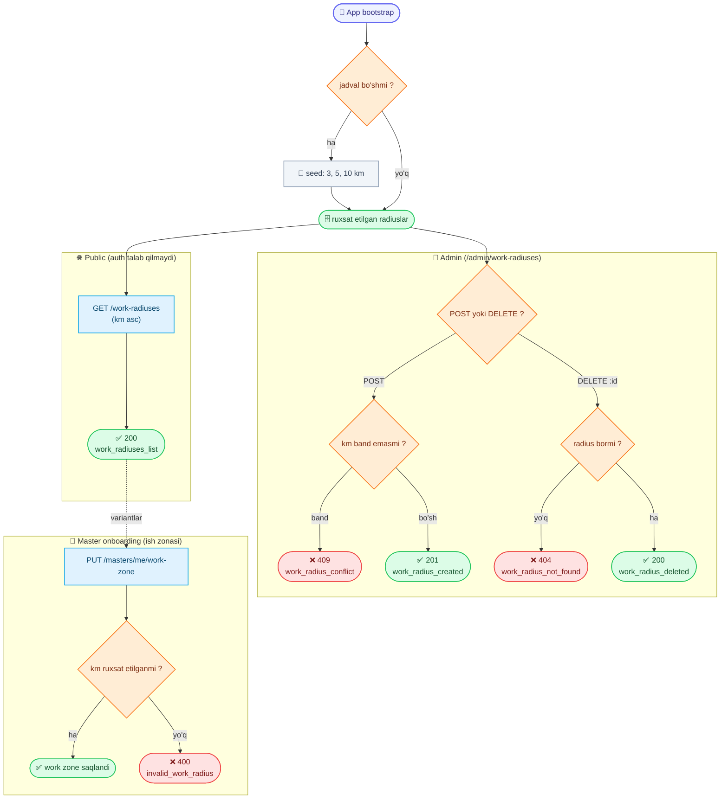

# Ish zonasi radiuslari (Work radii)

Reference (ma'lumotnoma) ma'lumotlari — master ro'yxatdan o'tishda "Ish zonasi" qadamida (qarang `MasterRegister.md`) **faqat shu ro'yxatdagi** radius qiymatlaridan birini tanlay oladi; boshqa qiymat rad etiladi. O'qish **public**, sozlash (qo'shish / o'chirish) esa **admin**ga tegishli.

Base URL: `https://api.fixleo.com/api/v1`

> **Til:** barcha `message` (va validatsiya `errors[].message`) `Accept-Language` (uz / ru / en) bo'yicha tarjimalanadi — misollarda inglizcha keltirilgan. Umumiy format/qoidalar: `Backend Config for client.md`.

Barcha javoblar standart konvertda:

```json
{ "success": true, "message": "...", "data": {} }
```

Xatolar:

```json
{ "success": false, "message": "...", "statusCode": 404, "path": "...", "timestamp": "...", "requestId": "..." }
```

> Har bir javobda `X-Request-Id` header bo'ladi; xato konvertida ham `requestId` maydoni qaytadi (so'rovni kuzatish uchun).

`WorkRadiusResponseDto` maydonlari:

| Maydon      | Turi   | Izoh                              |
| ----------- | ------ | --------------------------------- |
| `id`        | number | Raqamli id (masalan `1`)          |
| `km`        | number | Radius, kilometrda (butun son)    |
| `createdAt` | string | ISO sana                          |
| `updatedAt` | string | ISO sana                          |

> **Default qiymatlar:** dastur birinchi marta ishga tushganda jadval bo'sh bo'lsa, avtomatik ravishda **3, 5, 10 km** yaratiladi (seed). Seed faqat jadval bo'sh bo'lganda ishlaydi — admin keyin o'chirsa yoki yangisini qo'shsa, qayta to'ldirilmaydi.

> **Admin route'lari** (`/admin/work-radiuses`) admin token talab qiladi (qarang `AdminLogin.md`): `Authorization: Bearer <admin accessToken>`. `admin` va `superadmin` rollarining ikkalasi ham kira oladi.
>
> **Public route'i** (`/work-radiuses`) auth talab qilmaydi.

---

## 🔄 Jarayon sxemasi (workflow)



---

## 1. Radiuslar ro'yxati (public)

`GET /work-radiuses`

Auth shart emas. Barcha radiuslar `km` bo'yicha **o'sish tartibida** (kichikdan kattaga) qaytadi — front shu tartibda ko'rsatishi mumkin.

**Response `200`:**

```json
{
  "success": true,
  "message": "Work radius options",
  "data": [
    { "id": 1, "km": 3,  "createdAt": "2026-06-15T00:00:00.000Z", "updatedAt": "2026-06-15T00:00:00.000Z" },
    { "id": 2, "km": 5,  "createdAt": "2026-06-15T00:00:00.000Z", "updatedAt": "2026-06-15T00:00:00.000Z" },
    { "id": 3, "km": 10, "createdAt": "2026-06-15T00:00:00.000Z", "updatedAt": "2026-06-15T00:00:00.000Z" }
  ]
}
```

> Ro'yxat kichik, shuning uchun **pagination yo'q** — to'liq massiv qaytadi.

---

## 2. Radiuslar ro'yxati (admin)

`GET /admin/work-radiuses`

Admin token talab qilinadi. Public ro'yxat bilan bir xil — barcha radiuslar `km` bo'yicha **o'sish tartibida** qaytadi (admin panel uchun). `admin` va `superadmin` rollarining ikkalasi ham kira oladi.

**Response `200`:**

```json
{
  "success": true,
  "message": "Work radius options",
  "data": [
    { "id": 1, "km": 3,  "createdAt": "2026-06-15T00:00:00.000Z", "updatedAt": "2026-06-15T00:00:00.000Z" },
    { "id": 2, "km": 5,  "createdAt": "2026-06-15T00:00:00.000Z", "updatedAt": "2026-06-15T00:00:00.000Z" },
    { "id": 3, "km": 10, "createdAt": "2026-06-15T00:00:00.000Z", "updatedAt": "2026-06-15T00:00:00.000Z" }
  ]
}
```

**Xatolar:**

| Kod | Sabab                        | Izoh                      |
| --- | ---------------------------- | ------------------------- |
| 401 | Admin token yo'q / noto'g'ri | `Access token is missing` |

---

## 3. Radius qo'shish (admin)

`POST /admin/work-radiuses`

Admin token talab qilinadi. Faqat **bitta raqam** (`km`) kiritiladi; `km` **unique** bo'lishi shart.

**Request:**

```json
{ "km": 15 }
```

| Maydon | Majburiy | Qoidalar                                  |
| ------ | -------- | ----------------------------------------- |
| `km`   | ✅       | Butun son, `1`–`500`. Unique bo'lishi shart |

**Response `201`:**

```json
{
  "success": true,
  "message": "Radius added",
  "data": { "id": 4, "km": 15, "createdAt": "2026-06-15T00:00:00.000Z", "updatedAt": "2026-06-15T00:00:00.000Z" }
}
```

**Xatolar:**

| Kod | Sabab                              | Izoh                              |
| --- | ---------------------------------- | --------------------------------- |
| 400 | Validatsiya — `km` majburiy/diapazondan tashqari | validatsiya xabari                |
| 401 | Admin token yo'q / noto'g'ri       | `Access token is missing`         |
| 409 | Shu radius allaqachon mavjud       | `Work radius 15 km already exists` |

---

## 4. Radiusni o'chirish (admin)

`DELETE /admin/work-radiuses/:id`

Admin token talab qilinadi.

**Response `200`:**

```json
{ "success": true, "message": "Radius deleted", "data": null }
```

**Xatolar:**

| Kod | Sabab                          | Izoh                          |
| --- | ------------------------------ | ----------------------------- |
| 401 | Admin token yo'q / noto'g'ri   | `Access token is missing`     |
| 404 | Radius topilmadi               | `Work radius #4 not found`    |

---

## 5. Master "Ish zonasi"da ishlatilishi

Master onboarding'dagi `PUT /masters/me/work-zone` (qarang `MasterRegister.md`) `workRadiusKm` qiymatini shu ro'yxatga tekshiradi. Agar qiymat ro'yxatda bo'lmasa — **`400`** qaytadi:

```json
{
  "success": false,
  "message": "Work radius 7 km is not allowed",
  "statusCode": 400,
  "path": "/api/v1/masters/me/work-zone",
  "timestamp": "...",
  "requestId": "..."
}
```

Shuning uchun front "Ish zonasi" ekranida radius variantlarini `GET /work-radiuses` dan olib ko'rsatadi — bu master faqat ruxsat etilgan qiymatni tanlashini kafolatlaydi.

---

## Endpointlar xulosasi

| Method   | Route                       | Auth   | Vazifa            | Message              |
| -------- | --------------------------- | ------ | ----------------- | -------------------- |
| `GET`    | `/work-radiuses`            | public | Ro'yxat (o'sish)  | `Work radius options`|
| `GET`    | `/admin/work-radiuses`      | admin  | Ro'yxat (o'sish)  | `Work radius options`|
| `POST`   | `/admin/work-radiuses`      | admin  | Qo'shish (`201`)  | `Radius added`       |
| `DELETE` | `/admin/work-radiuses/:id`  | admin  | O'chirish         | `Radius deleted`     |

Swagger: `https://api.fixleo.com/api/docs` ("Work radii" va "Admin: Work radii" bo'limlari).
